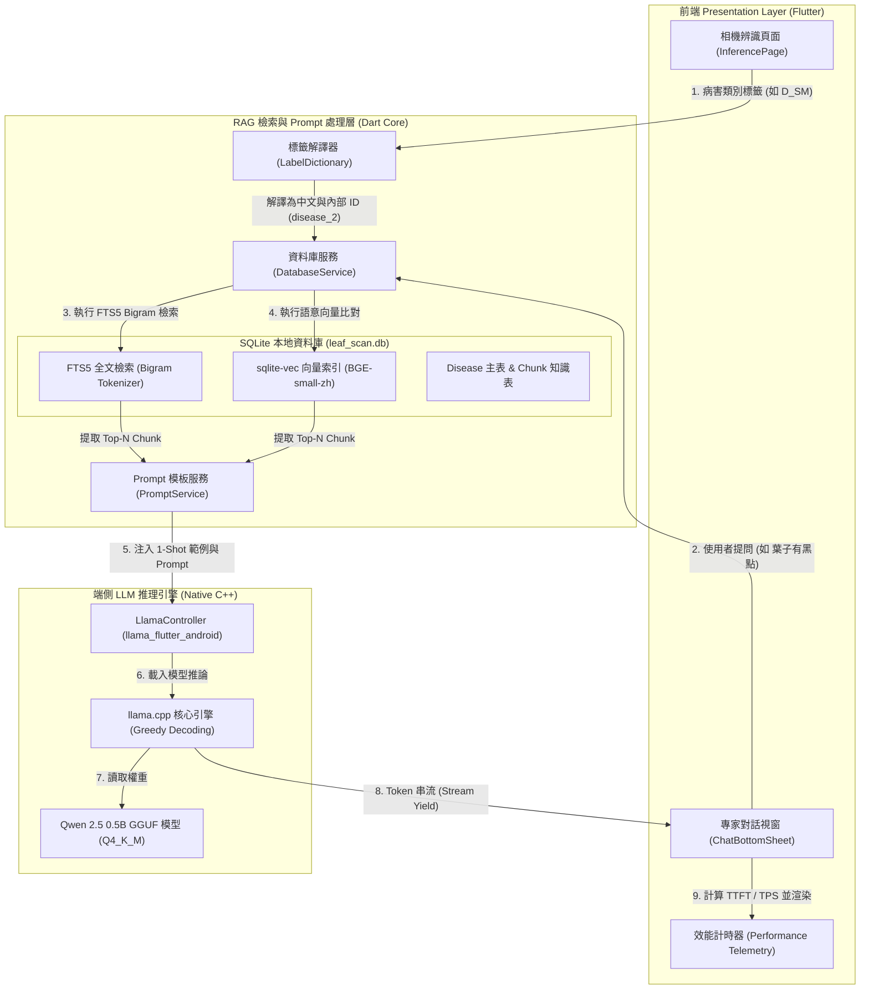
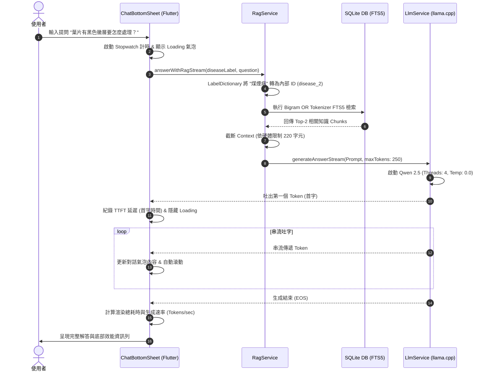

# 架構設計

## 1. 摘要

- 前端（Flutter）負責相機辨識與對話 UI，Dart 核心層負責 RAG 檢索與 Prompt 組裝，端側 LLM（Qwen 2.5 0.5B GGUF）以 llama.cpp 執行推論
- 檢索採 SQLite FTS5 Bigram 全文檢索 + sqlite-vec 向量索引雙引擎，離線環境下 0 額外依賴
- 端側模型選型比較顯示 Qwen 2.5 0.5B 在中階機（如 Galaxy A33）上為唯一可接受延遲與記憶體佔用的選擇
- 已規劃三級硬體自適應策略（旗艦／中階／入門機），依裝置分級調整檢索片段數與 Context 上限

## 2. 系統整體架構圖 (System Architecture)

## 3. 檢索與串流推論時序圖 (Execution Sequence Flow)

## 4. 技術選型與評估比較 (Technical Comparisons)

### 4.1 LLM 端側模型選型比較 (Qwen 2.5 0.5B vs 1.5B vs 其他)

| 評估維度 | Qwen 2.5 0.5B (本專案採用) | Qwen 2.5 1.5B (經測試退回) | Llama 3 8B / Gemma 2B |
| --- | --- | --- | --- |
| :--- | :--- | :--- | :--- |
| **模型檔大小 (GGUF Q4)** | **~360 MB** (極輕量) | ~1.1 GB (偏大) | > 2.0 GB ~ 4.5 GB |
| **首次啟動解壓/複製時間** | **~3 - 5 秒** (使用者體感順暢) | ~20 - 25 秒 (等待過久) | > 45 秒 (極易超時) |
| **記憶體佔用 (RAM)** | **~500 MB** | ~1.4 GB | > 2.5 GB ~ 4.0 GB |
| **中階機首字延遲 (A33 TTFT)** | **~5 - 8 秒** (經優化) | ~18 - 25 秒 | 閃退 / 無法載入 |
| **吐字速度 (Tokens/sec)** | **15 - 25 tok/s** (流暢) | 5 - 8 tok/s (偏慢) | < 2 tok/s |
| **幻覺與死循環風險** | 高 (已透過 1-Shot + Temp 0.0 克服) | 中 | 低 |
| **多機種適應性 (Cross-Device)** | **極佳** (低至 3GB RAM 機種皆可跑) | 較差 (4GB 以下容易 OOM) | 極差 (僅限頂級旗艦機) |

### 4.2 知識庫檢索機制比較 (FTS5 Bigram vs 單字搜尋 vs 向量檢索)

---

| 檢索機制 | 傳統單字精確搜尋 | 本專案使用 中文 Bigram FTS5 | 純向量檢索 (Vector Search) |
| --- | --- | --- | --- |
| :--- | :--- | :--- | :--- |
| **檢索原理** | 預設 SQLite `LIKE` 或單字匹配 | 將查詢拆解為二元詞網 (`"黑色"` OR `"色黴"`) | 將文本與問題轉為向量計算餘弦相似度 |
| **中文漏查率 (Recall)** | 高 (遇到同義詞或字序不同即匹配失敗) | **極低** (可完整涵蓋多字組合) | 低 (語意相似即可匹配) |
| **CPU 算力開銷** | 極低 | **極低** (< 10 ms 完成檢索) | 中高 (端側需要運算 Embedding 矩陣) |
| **離線依賴性** | 完全離線 | **完全離線 (0 額外依賴)** | 需載入 ONNX 模型與 Tokenizer |

## 5. RAG 雙引擎檢索與中文分詞架構 (Hybrid RAG Architecture)

### 5.1 檢索架構設計

- **SQLite + FTS5 全文檢索**：針對離線環境與輕量端側效能，採用 SQLite 內建 FTS5 引擎配合自研 **中文二元分詞（Bigram OR Tokenizer）**，將中文查詢自動切分為 Bigram（如 `"黑色"` OR `"色黴"` OR `"黴層"`），大幅解決傳統單字匹配導致的 0 筆檢索遺漏問題。
- **向量檢索擴充 (sqlite-vec / BGE-small-zh)**：結合語意向量索引，提升同義詞與模糊病徵描述的關聯度。
- **動態 ID 映射機制 (Disease ID Mapping)**：為避免使用者輸入中文病名（如 `"煤煙病"`）與 SQLite 內部主鍵（如 `disease_2`）衝突導致的錯位檢索，透過 `LabelDictionary` 與 `disease` 資料庫主表進行動態解譯，確保 100% 精準匹配病害 Chunks。

---

## 6. LLM 注意力集中與防幻覺機制 (Attention Control & Anti-Hallucination)

### 6.1 0.5B 端側小模型的挑戰

在端側資源極度受限環境下，0.5B 模型容易出現：

1. **死循環 (Attention Loops)**：對條列式數字或號碼產生無限迴圈。
2. **事實幻覺 (Hallucination)**：在開頭加入預訓練內置事實（例如虛構農科院論文數據）。
3. **語言漂移 (Language Drift)**：長句輸出時對 System Prompt 注意力衰減，逐漸切換為簡體中文。

### 6.2 防幻覺與注意力收斂策略

- **貪婪解碼 (Greedy Decoding / Temp 0.0)**：強制設定 `temperature: 0.0` 與 `topP: 0.0`，完全鎖死隨機性，防止模型自由發揮。
- **1-Shot 範例引導 (Few-Shot Pattern Anchoring)**：在 YAML Prompt 模板中注入單一標準問答示範，利用 Transformer 的 Pattern-Matching 本能，鎖定模型輸出格式為「繁體中文、無條列、單句流暢短答」。
- **ChatML 原生對話結構**：消除 `回答：` 或 Completion 結尾前綴，採用標準 User-Assistant 輪次，避免觸發文本自動補全範本。
- **嚴格否定約束 (Strict Negative Constraints)**：在 System Prompt 注入「絕對只能根據背景知識回答，不得使用外部知識或捏造事實」之高權重法則。

---

## 7. 多機種端側導入與硬體自適應策略 (Hardware-Adaptive Deployment)

---

### 7.1 端側延遲瓶頸 (TTFT vs. Prefill)

在三星 Galaxy A33（Exynos 1280, 6GB RAM）等中階手機上，首字延遲 (Time to First Token) 的主要瓶頸來自 CPU 對 Prompt 的 Prefill 注意力矩陣運算。

### 7.2 動態分級適應架構 (Dynamic Hardware Profiles)

| 裝置等級 / 代表機種 | 記憶體 (RAM) | CPU 執行緒 (Threads) | 檢索片段數 | Context 字元上限 | 預期首字延遲 (TTFT) |
| --- | --- | --- | --- | --- | --- |
| :--- | :--- | :--- | :--- | :--- | :--- |
| **旗艦機組** (S24 Ultra, Pixel 8) | **>= 8 GB** | **4 核心** | **3 Chunks** | **400 字元** | < 2 秒 |
| **中階機組** (Galaxy A33, A54) | **4 GB ~ 8 GB** | **4 核心** (強制大核) | **2 Chunks** | **220 字元** | 5~8 秒 |
| **入門機組** (極限防閃退) | **< 4 GB** | **1 核心** (安全牌) | **1 Chunk** | **150 字元** | 8~12 秒 |

### 7.3 前端串流與實時效能監控 (On-Device Telemetry)

- **極速回應串流**：採用 `llama.cpp` 串流吐字，首字到達時即時隱藏 Loading 並繪製 UI 氣泡。
- **對話效能計時器**：在 UI 氣泡底部實時計算並渲染：
    - `⚙️ 首字延遲` (RAG 檢索 + Prompt 準備 + LLM 啟動 + TTFT)
    - `載入耗時` (Model RAM Initialization)
    - `渲染總耗時` (Generation Duration)
    - `生成速度` (Tokens/sec 字數吐字速率)

## 8. 結論與限制

本架構以 SQLite FTS5 + sqlite-vec 雙引擎檢索搭配 Qwen 2.5 0.5B 端側推論，在中階機（4~8GB RAM）上取得可接受的延遲與防幻覺效果，並提供三級硬體自適應策略因應不同裝置。

本報告未涵蓋：實際多裝置實測數據（請見〈[系統測試與評估](../%E7%B3%BB%E7%B5%B1%E6%B8%AC%E8%A9%A6%E8%88%87%E8%A9%95%E4%BC%B0.md)〉）、資料庫 schema 的完整欄位定義。