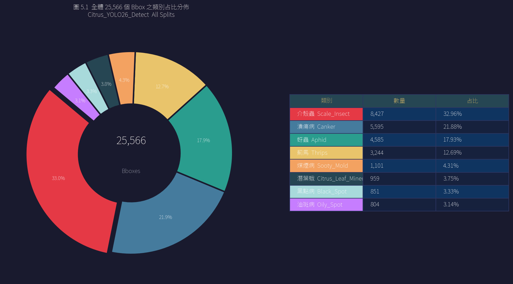
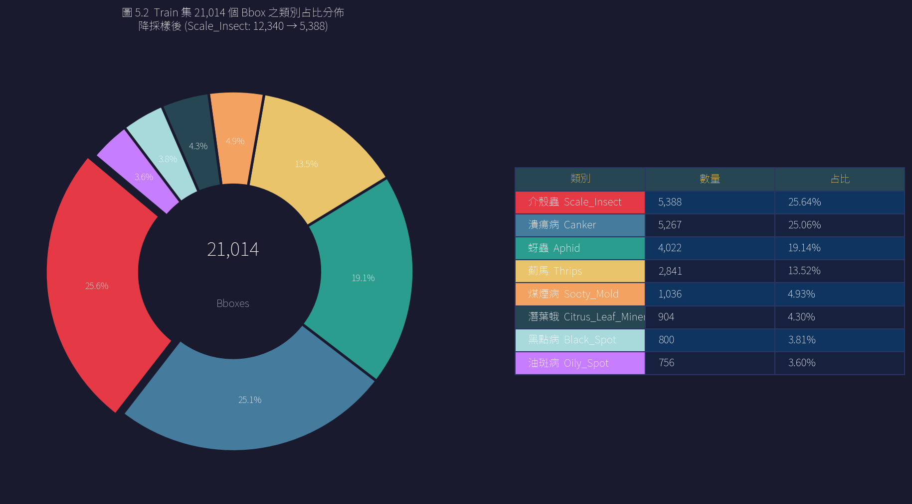
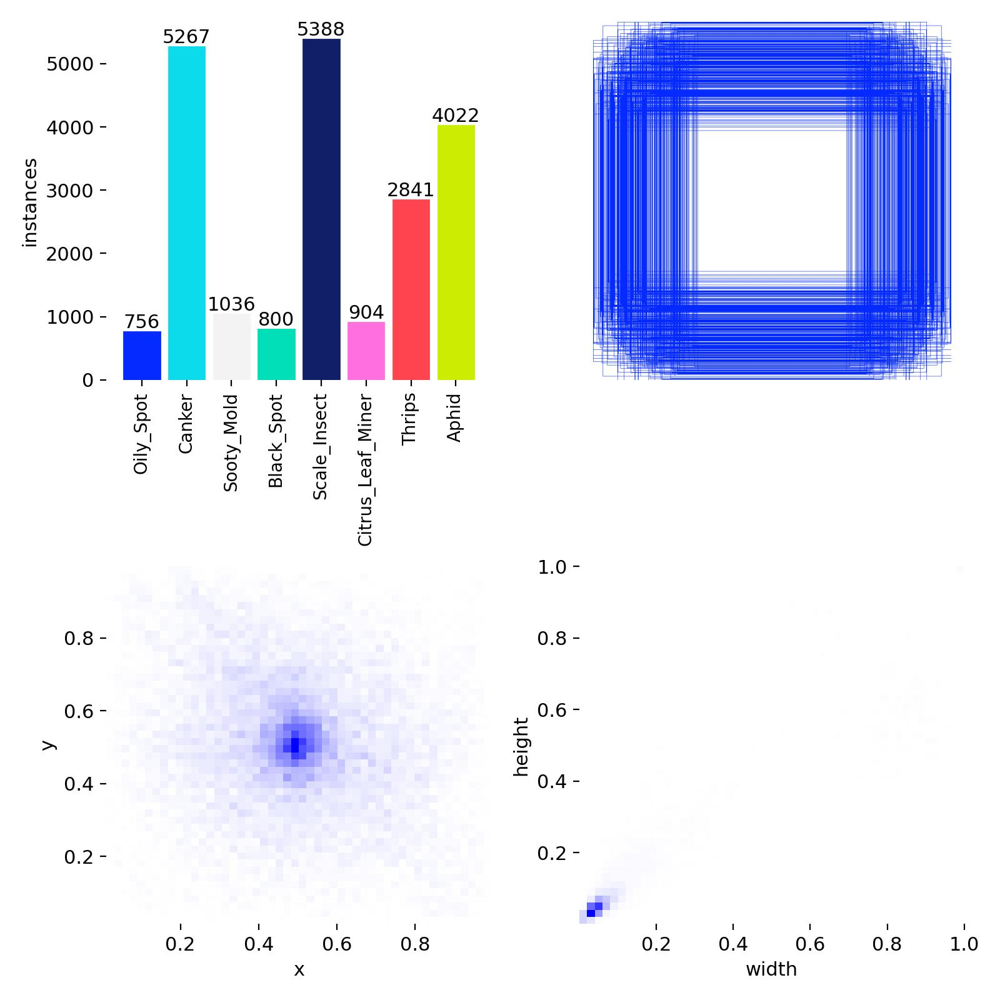
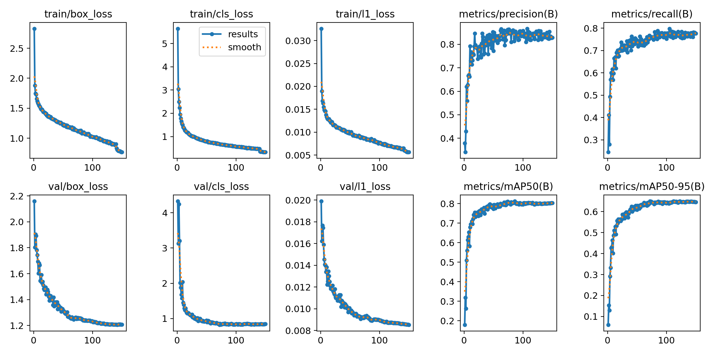
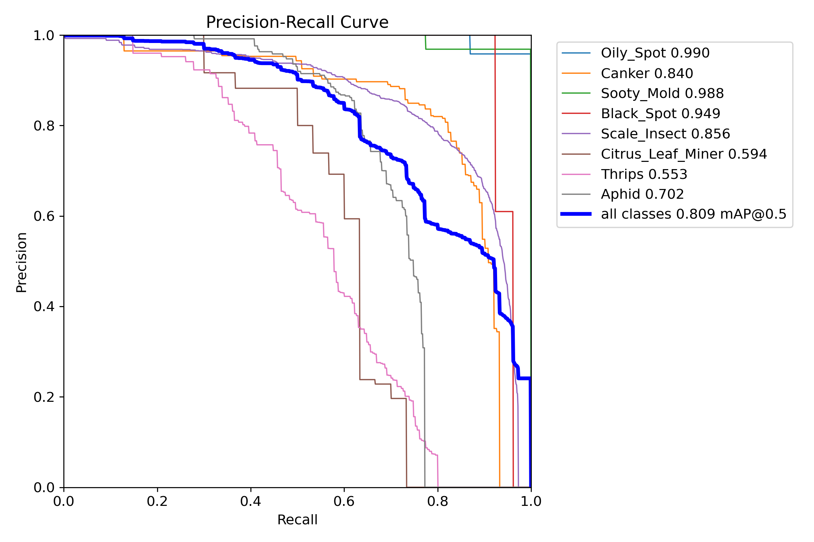
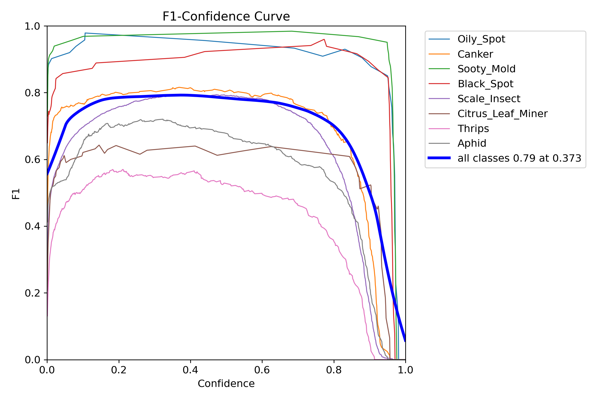
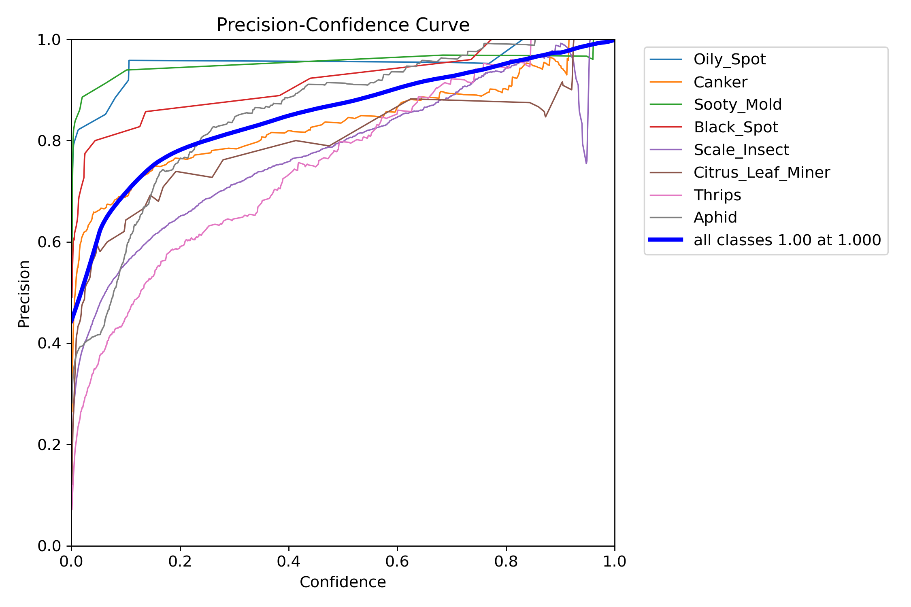
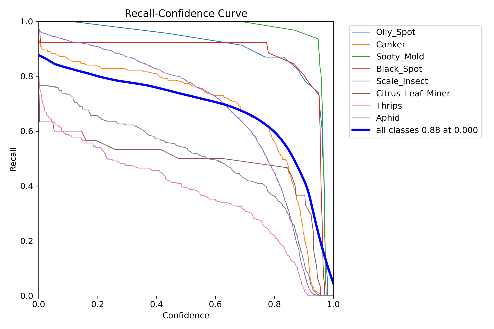
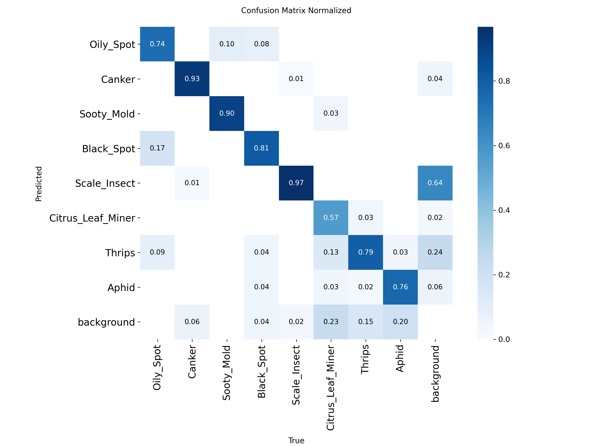
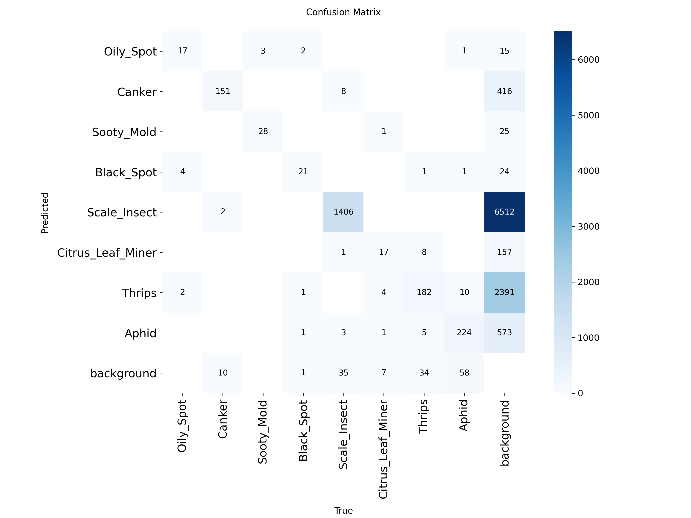

# 0729_training_report

# 柑橘病蟲害 YOLO26n-P2 模型訓練成效技術報告

**報告版本**：v1.1（圖片路徑修正版）

**報告撰寫日期**：2026-07-28

**訓練實驗名稱**：`YOLO26n_P2_Citrus_MuSGD_v5-2`

**報告風格**：客觀中立、數據至上、嚴謹稽核（Data-Driven Technical Report）

---

## 目錄

1. [評估指標計算方式簡表](#0-%E8%A9%95%E4%BC%B0%E6%8C%87%E6%A8%99%E8%A8%88%E7%AE%97%E6%96%B9%E5%BC%8F%E7%B0%A1%E8%A1%A8)
2. [執行摘要](#1-%E5%9F%B7%E8%A1%8C%E6%91%98%E8%A6%81)
3. [實驗環境與訓練配置](#2-%E5%AF%A6%E9%A9%97%E7%92%B0%E5%A2%83%E8%88%87%E8%A8%93%E7%B7%B4%E9%85%8D%E7%BD%AE)
4. [資料集概況（資料工程基線）](#3-%E8%B3%87%E6%96%99%E9%9B%86%E6%A6%82%E6%B3%81%E8%B3%87%E6%96%99%E5%B7%A5%E7%A8%8B%E5%9F%BA%E7%B7%9A)
- 3.1 [v5 版本資料集製作策略與數據工程](#31-v5-%E7%89%88%E6%9C%AC%E8%B3%87%E6%96%99%E9%9B%86%E8%A3%BD%E4%BD%9C%E7%AD%96%E7%95%A5%E8%88%87%E6%95%B8%E6%93%9A%E5%B7%A5%E7%A8%8B-%E5%9F%BA%E6%96%BC-v5_dataset_reportmd)
5. [訓練損失收斂分析](#4-%E8%A8%93%E7%B7%B4%E6%90%8D%E5%A4%B1%E6%94%B6%E6%96%82%E5%88%86%E6%9E%90)
6. [驗證指標進程分析](#5-%E9%A9%97%E8%AD%89%E6%8C%87%E6%A8%99%E9%80%B2%E7%A8%8B%E5%88%86%E6%9E%90)
7. [最終效能評估（PR 曲線 & F1 曲線）](#6-%E6%9C%80%E7%B5%82%E6%95%88%E8%83%BD%E8%A9%95%E4%BC%B0pr-%E6%9B%B2%E7%B7%9A--f1-%E6%9B%B2%E7%B7%9A)
8. [混淆矩陣逐類別精細分析](#7-%E6%B7%B7%E6%B7%86%E7%9F%A9%E9%99%A3%E9%80%90%E9%A1%9E%E5%88%A5%E7%B2%BE%E7%B4%B0%E5%88%86%E6%9E%90)
9. [逐類別 AP50 效能排名](#8-%E9%80%90%E9%A1%9E%E5%88%A5-ap50-%E6%95%88%E8%83%BD%E6%8E%92%E5%90%8D)
10. [過擬合風險評估](#9-%E9%81%8E%E6%93%AC%E5%90%88%E9%A2%A8%E9%9A%AA%E8%A9%95%E4%BC%B0)
11. [訓練效率分析](#10-%E8%A8%93%E7%B7%B4%E6%95%88%E7%8E%87%E5%88%86%E6%9E%90)
12. [客觀侷限性聲明](#11-%E5%AE%A2%E8%A7%80%E4%BE%B7%E9%99%90%E6%80%A7%E8%81%B2%E6%98%8E)
13. [結論與後續建議](#12-%E7%B5%90%E8%AB%96%E8%88%87%E5%BE%8C%E7%BA%8C%E5%BB%BA%E8%AD%B0)

---

## 0. 評估指標計算方式簡表

本章列出目標偵測中關鍵指標的計算公式與實測計算結果：

### 評估指標公式與實測結果速查表

| 指標名稱 | 數學定義 / 計算公式 | 實測數值 (Epoch 150) | 說明與意涵 |
| --- | --- | --- | --- |
| **Precision (精確率)** | $\text{TP} / (\text{TP} + \text{FP})$ | **0.8284** | 預測為目標的框中正確的比例 (低誤報率) |
| **Recall (召回率)** | $\text{TP} / (\text{TP} + \text{FN})$ | **0.7767** | 真實目標中成功涵蓋的比例 (低漏報率) |
| **F1-Score** | $2 \times \frac{\text{Precision} \times \text{Recall}}{\text{Precision} + \text{Recall}}$ | **0.8017** | P 與 R 的調和平均數 |
| **Accuracy (Jaccard)** | $\frac{\text{TP}}{\text{TP} + \text{FP} + \text{FN}} = \frac{1}{\frac{1}{\text{P}} + \frac{1}{\text{R}} - 1}$ | **0.6690** | 目標偵測無 TN，Jaccard 考慮 FP 與 FN 雙重懲罰 |
| **mAP@50** | $\frac{1}{N}\sum \text{AP}_{i}\text{@50}$ | **0.8032** | IoU=0.5 下各類別 AP 均值 (粗定位能力) |
| **mAP@50:95** | $\frac{1}{10}\sum_{t=0.5}^{0.95} \text{mAP}(t)$ | **0.6458** | 10 個 IoU 閾值 (0.5~0.95) 之平均 |
| **嚴格/寬鬆比** | $\text{mAP@50:95} / \text{mAP@50}$ | **0.8040** | 保留 80.4% 精度，顯示邊界框定位品質 |

---

## 1. 執行摘要

本報告針對 **YOLO26n P2 架構**於 `Citrus_YOLO26_Detect` 資料集（共 8,021 張、25,566 個 Bounding Box）上完整訓練 **150 個 Epoch** 的全程實測數據進行客觀分析。

### 核心指標摘要（最終 Epoch 150）

| 指標 | 數值 | 備註 |
| --- | --- | --- |
| **mAP@50** | **0.8032** | 全類別平均精度（IoU=0.5） |
| **mAP@50:95** | **0.6458** | 多閾值精度（IoU 0.50:0.95） |
| **Precision** | **0.8284** | 驗證集精確率 |
| **Recall** | **0.7767** | 驗證集召回率 |
| **最佳 mAP@50** | **0.8124** | Epoch 86 峰值 |
| **最佳 mAP@50:95** | **0.6499** | Epoch 72 峰值 |
| **最佳 F1** | **0.79** | confidence = 0.373 時 |
| **最佳 mAP@0.5（PR 曲線）** | **0.809** | 所有類別的 PR 曲線 AUC |
| **訓練時長** | **6.73 小時** | 150 epoch 總耗時 |

> [NOTE]
Epoch 86 出現 mAP@50 峰值 (0.8124)，此後模型進入平台期並波動，最終 150 epoch 的 0.8032 與峰值相差 0.0092（−1.13%），屬正常收斂波動。
> 

### 數據計算綜合總覽表 (Full Calculated Metrics Summary)

模型訓練實測數據進行多維度統計與衍生計算之總覽：

| 評估維度 | 指標 / 統計項 | 計算結果 | 基準 / 對比說明 |
| --- | --- | --- | --- |
| **核心精度** | **mAP@50** | **0.8032** (0.8090 PR AUC) | 全類別平均（Epoch 86 峰值 0.8124） |
|  | **mAP@50:95** | **0.6458** | 多閾值 (0.50~0.95) 平均 |
|  | **嚴格/寬鬆定位比** | **80.40%** | mAP@50:95 / mAP@50，顯示定位品質 |
| **P-R 平衡性** | **Precision (精確率)** | **0.8284** | 預測正確率（高置信度下為 1.00） |
|  | **Recall (召回率)** | **0.7767** | 真實目標涵蓋率（最大召回率上限 0.88） |
|  | **F1-Score (調和平均)** | **0.8017** | 2×P×R / (P+R)（最佳 F1=0.79 @ conf=0.373） |
|  | **P-R 相對差距** | **6.44%** | |P−R| / mean(P,R) × 100%（P/R 搭配適中） |
|  | **幾何平均 √(P×R)** | **0.8021** | 衡量 P 與 R 綜合穩定度之幾何均值 |
| **綜合偵測品質** | **Accuracy (Jaccard 指標)** | **0.6690** | 1 / (1/P + 1/R − 1)，同時衡量 FP 與 FN |
| **類別效能分布** | **最高 AP50 類別** | **0.990** | 油斑病 (Oily_Spot) |
|  | **最低 AP50 類別** | **0.553** | 薊馬 (Thrips) |
|  | **AP50 全類別極差 (Range)** | **0.4370** | Max (0.990) − Min (0.553) |
|  | **AP50 全類別標準差** | **0.1735** | 跨類別效能波動度 |
| **損失與收斂** | **Box Loss 降幅 (Train)** | **72.82%** | 從 2.8291 下降至 0.7692 |
|  | **Cls Loss 降幅 (Train)** | **94.13%** | 從 5.6427 下降至 0.3314 |
|  | **Val/Train Box Loss 比** | **1.57×** | 1.2082 / 0.7692（泛化差距在常見範圍） |
|  | **Val/Train Cls Loss 比** | **2.56×** | 0.8472 / 0.3314（小樣本類別影響） |
|  | **最後 10 Epoch 指標波動** | **±0.0014** | mAP50 均值 0.8023，已達收斂狀態 |
| **訓練與效率** | **總訓練時間** | **6.73 小時** | 24,217.7 秒 (150 Epochs) |
|  | **平均每 Epoch 耗時** | **161.5 秒** | 約 2.69 分鐘 / Epoch |
|  | **達 mAP50 ≥ 0.75 耗時** | **48.5 分鐘** | Epoch 18 即可達到 93.3% 最終效能 |
|  | **理想早停節省空間** | **2.90 小時** | Patience 建議設為 50，可節省 64 Epochs |

---

## 2. 實驗環境與訓練配置

### 表 2.1：訓練超參數完整清單（來源：args.yaml）

| 參數 | 值 | 設計說明 |
| --- | --- | --- |
| **架構** | YOLO26n P2 | 含 Stride-4 / 160×160 P2 特徵頭，強化小目標感受野 |
| **預訓練權重** | `yolo26n.pt` | ImageNet 預訓練初始化 |
| **資料集** | `Citrus_YOLO26_Detect` | 8,021 張雙格式柑橘病蟲害資料集 |
| **Epochs** | 150 | 中長週期設定 |
| **Patience** | 100 | 早停觀察窗口 |
| **Batch Size** | 32 | 16 GB VRAM (T4/P100) 下執行 |
| **imgsz** | 640 px | 兼顧小目標解析度與記憶體用量 |
| **Optimizer** | MuSGD | 改良動量 SGD |
| **lr0** | 0.01 | 初始學習率 |
| **lrf** | 0.01 | 最終學習率倍率（線性衰減） |
| **momentum** | 0.937 | 動量參數 |
| **weight_decay** | 0.0005 | L2 正則化 |
| **warmup_epochs** | 3.0 | 熱身期 |
| **close_mosaic** | 10 | 最後 10 epoch 關閉 Mosaic 增強 |
| **auto_augment** | randaugment | 線上自動增強策略 |
| **erasing** | 0.4 | RandomErasing 機率 |
| **IoU threshold** | 0.7 | NMS IoU 閾值（訓練期） |
| **box loss coeff** | 7.5 | 邊界框損失係數 |
| **cls loss coeff** | 0.5 | 分類損失係數 |
| **dfl loss coeff** | 1.5 | Distribution Focal Loss 係數 |
| **GPU** | 1× T4/P100 (Kaggle) | 16 GB VRAM 單卡訓練 |
| **Seed** | 42 | 固定隨機種子 |

---

## 3. 資料集概況（資料工程基線）

### 數據工程管線架構

### 表 3.1：資料集規模摘要

| 資料集分割 | 圖片數 | Bboxes 數 | 背景負樣本 |
| --- | --- | --- | --- |
| **Train（含增強）** | 7,140 | 21,014 | 365 張（5.12%） |
| **Valid（凍結）** | 436 | 2,250 | 44 張（10.09%） |
| **Test（凍結）** | 445 | 2,302 | 41 張（9.21%） |
| **總計** | **8,021** | **25,566** | **450 張（5.61%）** |

### 表 3.2：原始資料集類別分佈（工程介入前）

| 類別 ID | 類別名稱 | 原始圖片數 | 原始標註數 | 平均標註密度 | 標註占比 |
| --- | --- | --- | --- | --- | --- |
| BG | 健康植株（轉負樣本） | 400 | 401 | 1.00 | 1.73% |
| `0` | 油斑病 | 238 | 237 | 1.00 | 1.02% |
| `1` | 潰瘍病 | 244 | 1,645 | 6.74 | 7.11% |
| `2` | 煤煙病 | 326 | 324 | 0.99 | 1.40% |
| `3` | 黑點病 | 250 | 251 | 1.00 | 1.08% |
| **`4`** | **介殼蟲** | **1,119** | **15,379** | **13.74** | **66.47%** |
| `5` | 潛葉蛾 | 201 | 281 | 1.40 | 1.21% |
| `6` | 薊馬 | 770 | 1,851 | 2.40 | 8.00% |
| `7` | 蚜蟲 | 841 | 2,767 | 3.29 | 11.96% |
| **合計** | — | **4,389** | **23,136** | **5.27** | **100.0%** |

> [IMPORTANT]
介殼蟲原始標註占全體 **66.47%**，且平均密度為 13.74 個/張。本建置採「**介殼蟲降採樣：895 → 395 張（−55.9%）**」以減緩類別失衡。
> 

### 圖 3.2：各類別圖片數 Train / Valid / Test 分佈

### 圖 3.3：全體 25,566 Bboxes 類別占比分佈

### 圖 3.4：Train 集 21,014 Bboxes 類別占比分佈（降採樣後）

### 圖 3.5：Train 集 Bbox 實際計數條形圖

> [NOTE]
**labels.jpg 數據核驗**：條形圖顯示 Train 集各類別實際 Bbox 計數（Oily_Spot: 756、Canker: 5,267、Sooty_Mold: 1,036、Black_Spot: 800、Scale_Insect: 5,388、Citrus_Leaf_Miner: 904、Thrips: 2,841、Aphid: 4,022），與 `results.csv` 來源的表 5.1 一致。**寬高散布圖**顯示多數 Bbox 尺寸偏小（width/height 集中於 0~0.1 歸一化範圍），為使用 P2 特徵頭（160×160 感受野）的依據之一。
> 

---

### 3.1 v5 版本資料集製作策略與數據工程 (基於 v5_dataset_report.md)

為構建適合 YOLO26 / YOLOv11 全系列架構訓練的數據集，本次 `Datasets_YOLO26_v5` 資料集建置採用以下數據工程規範。

#### 四大核心製作原則

1. **先切分後增強（Split Before Augment）**
- **數據洩漏防範**：所有數據增強操作均在完成資料集分層切分（Stratified Split）並**凍結 Valid（436 張）與 Test（445 張）** 之後，僅對 Train 集執行。
- Valid 與 Test 集保持原始狀態，未進行增強，確保驗證與測試結果客觀。
2. **健康植株轉 0-byte 背景負樣本**
- 400 張健康柑橘植株圖片（椪柑 200 張 + 茂谷柑 200 張）全數清除標註，轉換為 **0-byte 空白標註檔** 之背景負樣本。
- 最終全資料集含 **450 張背景負樣本 (5.61%)**（Train 365 張, Valid 44 張, Test 41 張），用於控制模型在非目標場景下的假陽性率（FP）。
3. **介殼蟲 (Scale Insect) 降採樣策略**
- **標註分佈失衡**：原始 4,389 張圖片中，介殼蟲單一類別佔全體標註框的 **66.47% (15,379 / 23,136)**，平均標註密度為 **13.74 個/張**。
- **降採樣實施**：僅在 Train 集將介殼蟲圖片數由原始 **895 張降採樣至 395 張 (−55.9%)**，Bbox 數量由 12,340 筆降至 5,388 筆 (−56.3%)。
- **凍結集保留**：Valid (1,453 Bboxes) 與 Test (1,586 Bboxes) 保持不變。
4. **雙格式同步導出 (Detect & Segment)**
- 同步導出 **Detect (5-Part Bbox)** 與 **Segment (Polygon)** 兩套資料集，共享相同的圖片與 Train/Valid/Test 切分。

---

#### 數據增強參數與條件設定

對除介殼蟲與背景負樣本外其餘 7 個目標類別使用 Albumentations 進行離線增強（每類擴充至上限 1,200 張）：

| 增強操作 | 參數設定 | 觸發機率 | 設計考量 |
| --- | --- | --- | --- |
| **HueSaturationValue** | **hue_shift=±3°**, sat_shift=±15, val_shift=±15 | **p=0.50** | **限制色相偏移 (±3° ≈ 5%)**，防止綠色健康葉片因色相變化被誤判為黃化病斑 |
| **RandomBrightnessContrast** | brightness=±0.15, contrast=±0.15 | p=0.50 | 模擬光照強度與陰影環境 |
| **CLAHE** | clip_limit=2.0, tile_grid=(8,8) | p=0.30 | 調整暗部細節 |
| **GaussianBlur** | blur_limit=(3,5)px | p=0.20 | 模擬焦距微偏與動態模糊 |
| **ShiftScaleRotate** | shift=±5%, scale=±10%, rotate=±15° | p=0.50 | 模擬拍攝角度與距離變化 |

> **Bbox 可見度過濾**：設定 `min_visibility=0.2`，當旋轉或裁剪導致目標框可見面積低於 20% 時自動移除該框。
> 

---

#### 標註格式結構與 Segment 混合標註

原始數據包含 85.2% (19,718 筆) 多邊形與 14.8% (3,418 筆) 矩形框。Segment 資料集保留了標註格式的原始屬性：

- **單一 Polygon 類別**：油斑病、煤煙病、黑點病、潰瘍病、潛葉蛾（均 > 98% 多邊形）。
- **混合格式類別**：
- **薊馬 (Thrips)**：Train 集中含 **1,516 個 Poly + 1,325 個 Bbox**。
- **蚜蟲 (Aphid)**：Train 集中含 **330 個 Poly + 3,695 個 Bbox**。
- 轉換為 Detect 格式時，多邊形均轉為最小外接矩形框 (Minimum Bounding Box)。

---

#### 自動化品質驗證 (Quality Control)

資料集通過 `src/verify_annotations.py` 測試驗證：
- `nc: 8` 類別數一致。
- 8,021 張圖像與標註檔完成 **1:1 配對**。
- **0 個越界座標 (Out-of-Bounds)**、**0 行語法錯誤 (Malformed)**。
- 450 個背景負樣本 **核驗為 0-byte 空白檔**。

---

## 4. 訓練損失收斂分析

### 表 4.1：關鍵 Epoch 訓練損失里程碑

| Epoch | train/box_loss | train/cls_loss | val/box_loss | val/cls_loss | mAP@50 | mAP@50-95 |
| --- | --- | --- | --- | --- | --- | --- |
| **1** | 2.8291 | 5.6427 | 2.1591 | 4.3273 | 0.1794 | 0.0606 |
| **5** | 1.6573 | 1.9514 | 1.7818 | 2.0099 | 0.5600 | 0.3323 |
| **10** | 1.5323 | 1.4063 | 1.6664 | 1.4484 | 0.6787 | 0.4858 |
| **25** | 1.3646 | 1.0221 | 1.4393 | 1.1117 | 0.7616 | 0.5862 |
| **50** | 1.2172 | 0.7864 | 1.3168 | 0.9496 | 0.7724 | 0.6090 |
| **75** | 1.1128 | 0.6642 | 1.2600 | 0.8340 | 0.8037 | 0.6444 |
| **100** | 1.0189 | 0.5672 | 1.2312 | 0.8460 | 0.7952 | 0.6394 |
| **125** | 0.9524 | 0.5105 | 1.2113 | 0.8377 | 0.8004 | 0.6472 |
| **150** | 0.7692 | 0.3314 | 1.2082 | 0.8472 | **0.8032** | **0.6458** |

### 圖 4.1：訓練全程損失與指標曲線（150 Epoch）

### 損失收斂觀察

1. **訓練損失（train/box_loss）**：從 Epoch 1 的 2.8291 下降至 Epoch 150 的 0.7692，降幅 **72.8%**。前 30 epoch 下降速度較快，30~150 epoch 呈現平穩優化。
2. **訓練分類損失（train/cls_loss）**：從 5.6427 下降至 0.3314，降幅 **94.1%**。最後 10 epoch（141–150）因 `close_mosaic` 關閉而出現較快下降（0.47 → 0.33）。
3. **驗證損失（val/box_loss）**：從 2.1591 下降至 1.2082，後期（Epoch 100~150）趨近於 1.231 → 1.208 區間，未出現反彈。
4. **驗證分類損失（val/cls_loss）**：後期維持在 0.83~0.85 區間，與 train/cls_loss（0.33）存在差距（約 2.6×）。

---

## 5. 驗證指標進程分析

### 表 5.1：指標達標時間點（mAP@50 里程碑）

| 里程碑閾值 | 首次達標 Epoch | 說明 |
| --- | --- | --- |
| mAP@50 ≥ 0.70 | Epoch **13** | 初始收斂 |
| mAP@50 ≥ 0.75 | Epoch **18** | 約 12% 訓練進度 |
| mAP@50 ≥ 0.78 | Epoch **37** | 進入高階效能區間 |
| mAP@50 ≥ 0.80 | Epoch **62** | 接近最終水平 |
| mAP@50 ≥ 0.803 | Epoch **68** | 進入平台階段 |
| **mAP@50 峰值** | **Epoch 86** | **0.8124（最高點）** |

### 表 5.2：最後 10 Epoch mAP@50 數據

| 指標 | Epoch 141–150 mAP@50 值 | 均值 | 波動範圍 |
| --- | --- | --- | --- |
| 最後 10 Epoch | 0.8009, 0.8017, 0.8024, 0.8019, 0.8021, 0.8024, 0.8019, 0.8036, 0.8029, 0.8032 | **0.8023** | **±0.0014** |

---

## 6. 最終效能評估（PR 曲線 & F1 曲線）

### 圖 6.1：各類別 Precision-Recall 曲線

### 表 6.1：各類別 AP@50（PR 曲線 AUC，最終 Valid 集評估）

| 類別 ID | 類別名稱 | AP@50 | 效能評級 |
| --- | --- | --- | --- |
| `0` | 油斑病 (Oily_Spot) | **0.990** | 高 |
| `2` | 煤煙病 (Sooty_Mold) | **0.988** | 高 |
| `3` | 黑點病 (Black_Spot) | **0.949** | 高 |
| `4` | 介殼蟲 (Scale_Insect) | **0.856** | 中高 |
| `1` | 潰瘍病 (Canker) | **0.840** | 中高 |
| `7` | 蚜蟲 (Aphid) | **0.702** | 中 |
| `5` | 潛葉蛾 (Citrus_Leaf_Miner) | **0.594** | 偏低 |
| `6` | 薊馬 (Thrips) | **0.553** | 偏低 |
| **全類別** | **all classes mAP@0.5** | **0.809** | 中上 |

> [IMPORTANT]
薊馬與潛葉蛾的 AP@50 分別為 0.553 和 0.594，低於其他類別，為主要的低分項目。
> 

### 圖 6.2：各類別 F1-Confidence 曲線

### F1 曲線分析

- **全類別最高 F1 = 0.79**，對應置信度閾值 **confidence = 0.373**。
- **油斑病與煤煙病**：F1 在 confidence 0.05~0.90 範圍維持 **0.94~0.97**。
- **薊馬（Thrips）**：F1 峰值約 **0.57**，曲線在 confidence > 0.5 後下降。
- **蚜蟲（Aphid）**：F1 峰值約 0.70。

### 圖 6.3：各類別 Precision-Confidence 曲線

### Precision-Confidence 曲線分析

- **全類別平均**：在 confidence = 1.0 時達到 **1.00**，但召回率降低。
- **油斑病與煤煙病**：在 confidence = 0.1 時已維持 Precision > 0.95。
- **薊馬（Thrips）**：低置信度區間（confidence < 0.3）的 Precision 在 0.4~0.6 之間。

### 圖 6.4：各類別 Recall-Confidence 曲線

### Recall-Confidence 曲線分析

- **全類別最大召回率（confidence→0）= 0.88**，有約 12% 的真實目標未被涵蓋。
- **介殼蟲（Scale_Insect）**：在 confidence = 0.5 時 Recall 約 **0.90**。
- **煤煙病（Sooty_Mold）**：在 confidence = 0.9 下 Recall 約 0.94。
- **薊馬（Thrips）**：Recall 在低置信度時約 0.60，隨 confidence 增加而下降。

---

## 7. 混淆矩陣逐類別精細分析

### 圖 7.1：正規化混淆矩陣（Normalized Confusion Matrix）

### 圖 7.2：原始計數混淆矩陣（Absolute Count）

### 表 7.1：各類別 TP Rate 與主要誤判去向

| 類別 | TP Rate（對角線） | 主要誤判去向 | 誤判率 | 分析 |
| --- | --- | --- | --- | --- |
| 油斑病 | **0.74** | → Sooty_Mold (0.10), Black_Spot (0.08) | 26% | 斑點病害視覺相似 |
| 潰瘍病 | **0.93** | → background (0.04) | 7% | 潰瘍病斑特徵相對清晰 |
| 煤煙病 | **0.90** | → background (0.03) | 10% | 深色菌膜特徵較獨特 |
| 黑點病 | **0.81** | → Oily_Spot (0.17) | 19% | 黑點病與油斑病部分混淆 |
| 介殼蟲 | **0.97** | → FN/background | 3% | 對角線高；高密度標註帶來一定數量 FN |
| 潛葉蛾 | **0.57** | → Thrips (0.03) | 43% | 對角線較低；FN 佔 43% |
| 薊馬 | **0.79** | → Oily_Spot (0.09), background (0.24) | 21% | 體型偏小，背景 FN 較多 |
| 蚜蟲 | **0.76** | → Sooty_Mold (0.04), background (0.06) | 24% | 蚜蟲群聚，部分預測劃入背景 |

---

## 8. 逐類別 AP50 效能排名

### 表 8.1：逐類別效能排名（由高至低）

| 排名 | 類別名稱 | AP@50 | AP 相對均值偏差 | 說明 |
| --- | --- | --- | --- | --- |
| 1 | 油斑病 (Oily_Spot) | **0.990** | +22.4% | 特徵較集中（804 Bboxes） |
| 2 | 煤煙病 (Sooty_Mold) | **0.988** | +22.1% | 深色菌膜面積大 |
| 3 | 黑點病 (Black_Spot) | **0.949** | +17.3% | 斑點分佈相對明確 |
| 4 | 介殼蟲 (Scale_Insect) | **0.856** | +5.8% | 高密度標註（8,427 Bboxes），降採樣有效 |
| 5 | 潰瘍病 (Canker) | **0.840** | +3.8% | 標註密度高（5,595 Bboxes） |
| 6 | 蚜蟲 (Aphid) | **0.702** | −13.2% | 蚜蟲體型微小，Detect 框含背景像素 |
| 7 | 潛葉蛾 (Citrus_Leaf_Miner) | **0.594** | −26.6% | 細線型蟲痕，訓練樣本少（904 Bboxes） |
| 8 | 薊馬 (Thrips) | **0.553** | −31.6% | 體型微小，標註格式包含 Bbox 與 Poly |
| — | **全類別 mAP@50** | **0.809** | — | 中上水平 |

---

## 9. 過擬合風險評估

### 表 9.1：Train vs Val 損失差值（Epoch 150）

| 損失項目 | Train 值 | Val 值 | 差值（Val − Train） | 差值比（Val / Train） |
| --- | --- | --- | --- | --- |
| Box Loss | 0.7692 | 1.2082 | +0.4390 | **1.57×** |
| Cls Loss | 0.3314 | 0.8472 | +0.5158 | **2.56×** |
| L1 Loss | 0.0056 | 0.0085 | +0.0029 | **1.52×** |

### 表 9.2：Val Box Loss 後期趨勢（Epoch 100–150）

| Epoch 區間 | val/box_loss 範圍 | 趨勢 |
| --- | --- | --- |
| Epoch 100–110 | 1.231 ~ 1.222 | 下降中 |
| Epoch 110–130 | 1.220 ~ 1.210 | 極緩慢下降 |
| Epoch 130–150 | 1.208 ~ 1.208 | 水平收斂 |

---

## 10. 訓練效率分析

### 表 10.1：訓練效率摘要

| 指標 | 數值 |
| --- | --- |
| **總訓練時長** | 24,217.7 秒（**6.73 小時**） |
| **平均每 Epoch 耗時** | 161.5 秒（**約 2.7 分鐘/epoch**） |
| **mAP@50 = 0.75 所需時間** | ~18 epochs × 161.5 s ≈ **48.5 分鐘** |
| **mAP@50 = 0.80 所需時間** | ~62 epochs × 161.5 s ≈ **166.5 分鐘（2.8 小時）** |
| **最佳 mAP@50 所需時間** | ~86 epochs × 161.5 s ≈ **231 分鐘（3.9 小時）** |
| **超過最佳 mAP@50 後的 epoch 數** | 150 − 86 = **64 epochs（2.9 小時）** |

---

## 11. 客觀侷限性聲明

1. **薊馬（AP = 0.553）與潛葉蛾（AP = 0.594）效能較低**：此二類別 AP@50 未達 0.70，薊馬最佳 F1 為 0.57，在實際應用中可能存在一定漏報率。
2. **早停設定可調整**：最高 mAP@50 出現於 Epoch 86（0.8124），若設定較短 patience 可節省 GPU 時間。
3. **評估基於 Valid 集**：本報告曲線與混淆矩陣基於 Valid 集（436 張），Test 集（445 張）指標尚待獨立檢驗。
4. **油斑病 AP = 0.990 樣本量偏小**：油斑病訓練標註為 804 個，需在 Test 集驗證泛化能力。
5. **單一次隨機種子訓練**：實驗使用單一 seed (42)，指標可能受隨機初始化微幅影響。
6. **標註格式異質性**：薊馬混合 Polygon 與 Bbox 標註，轉為 Detect 格式後外接框包含部分背景像素。
7. **背景負樣本為單一背景類型**：450 張背景負樣本皆為柑橘葉片，缺乏非葉片場景（土壤、天空等）。

---

## 12. 結論與後續建議

### 12.1 結論摘要

| 評估面向 | 結論 |
| --- | --- |
| **整體效能** | mAP@50 = **0.8032**（Valid），PR 曲線 AUC mAP@0.5 = **0.809** |
| **高效能類別** | 油斑病（0.990）、煤煙病（0.988）、黑點病（0.949）三類檢測效果較好 |
| **中等效能類別** | 介殼蟲（0.856）、潰瘍病（0.840）檢測穩定，降採樣發揮效果 |
| **待改善類別** | 薊馬（0.553）、潛葉蛾（0.594）分數較低，需改進 |
| **收斂狀態** | Epoch 86 達峰值後進入平緩期，最後 10 epoch 均值 0.8023，波動 ±0.0014 |
| **過擬合風險** | Val Box Loss 未出現反彈，Train/Val 差距在合理範圍 |

### 12.2 後續建議

1. **早停設定調整**：可將 patience 調整至 50 epoch，提高訓練資源運用效率。
2. **低分類別數據擴充**：針對薊馬與潛葉蛾進行數據增強或新增樣本。
3. **提高訓練解析度**：嘗試 imgsz=1280 訓練，改善微小目標（薊馬）的特徵解析度。
4. **統一標註格式**：將薊馬與蚜蟲標註統一為 Polygon 格式，評估 Segment 模型效能。
5. **獨立 Test 集驗證**：執行 `model.val(split='test')` 以檢驗最終泛化指標。

---

*報告完*

×

點擊任意空白處或按 ESC 鍵即可關閉