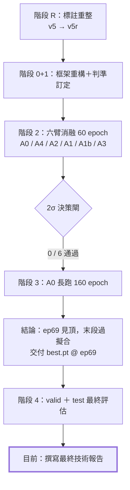
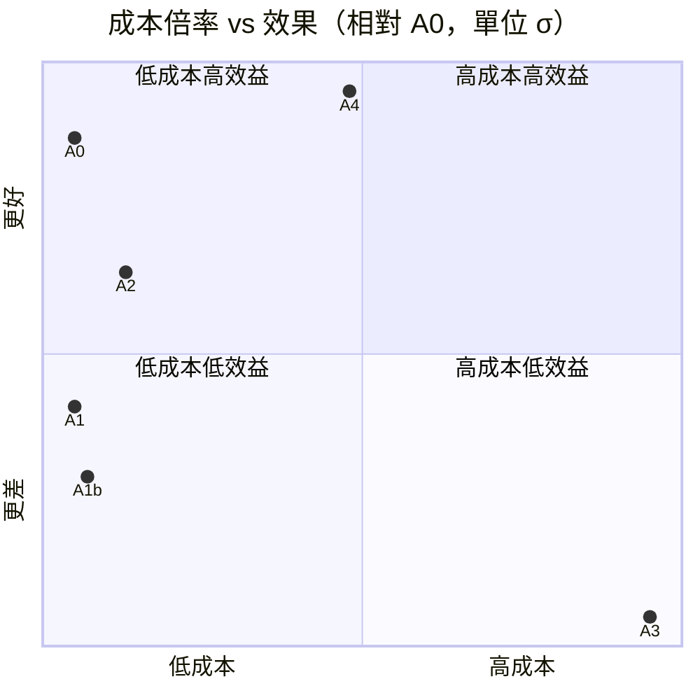
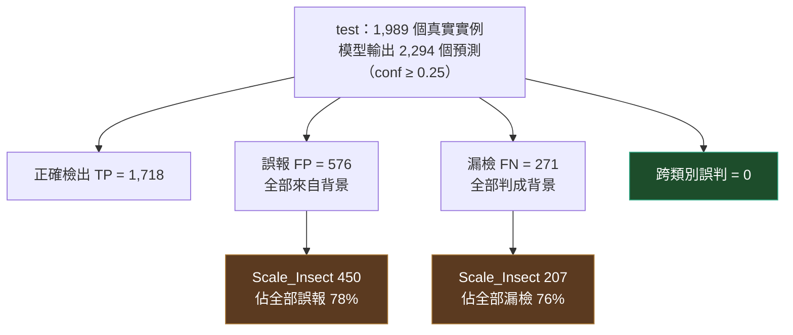
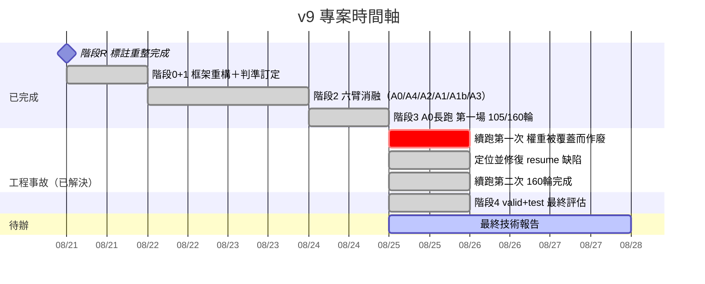

# 柑橘病蟲害辨識階段性進度週報（2026-08-25）

> **報告日期**：2026-08-25（報告期間：2026-08-18 → 2026-08-25）
> **評測對象**：`YOLO26n-P2`（v9 專案階段 2 六臂消融 · 階段 3 長跑 · 階段 4 最終評估）
> **資料來源**：訓練用程式碼庫 `docs/` 相關記錄文件（詳細實驗日誌見程式碼庫，不在本文件庫版控範圍）
> **撰寫人**：原始記錄未標註

## 1. 摘要

- **最終模型已定案**：交付權重 `best.pt`（epoch 69），於從未使用過的 test 集上取得 mAP@0.5 = **0.8908**、mAP@0.5:0.95 = **0.6783**、Precision 0.8995、Recall 0.8614。架構為官方預設 `yolo26-p2` 原型，載入不需任何自訂模組。
- **六臂消融（A4／A2／A1／A1b／A3，以 A0 為對照組）全數未通過 2σ 顯著性門檻**：自訂損失函數 Wise-Inner-MPDIoU、ADown 下採樣、StarTripletBlock 三項原創手段全部剔除，且呈現「改動成本越高、結果越差」的明確趨勢。
- **唯一有效的改動在資料端**：標註尺度重整（v5 → v5r）後，Thrips 的 AP@0.5 由 v8 時代（v5 標註）的 0.572 提升至 0.797（valid）／0.910（test），架構完全未動。跨類別「標註尺度極差 ↔ AP」相關係數 $\rho = -0.976$，事前預測精準命中。
- **160 輪的訓練排程過長**：模型在第 69 輪見頂，之後持續下滑，第 160 輪權重低了 0.015；末段為純粹過擬合，`close_mosaic` 未產生預期效益。
- **誤差結構單純且集中**：test 上八個類別之間沒有任何互相誤判，全部錯誤皆為背景誤報（576）或背景漏檢（271）；其中 Scale_Insect 一類即佔誤報的 78%、漏檢的 76%。

### 核心評估指標總覽

| 項目 / Split | mAP@0.5 | mAP@0.5:0.95 | Precision | Recall | 最佳 F1 截斷點 |
| --- | ---: | ---: | ---: | ---: | ---: |
| **A0 長跑 best.pt（ep 69，valid）** | 0.8665 | 0.6536 | 0.8860 | 0.8076 | 0.4985 |
| **A0 長跑 best.pt（ep 69，test 交付版本）** | **0.8908** | **0.6783** | **0.8995** | **0.8614** | 0.3954 |
| 六臂消融 60 輪基準 A0（valid 平台期） | 0.8507 | 0.6340 | — | — | — |
| 歷史對照 v8（valid，best-epoch 69） | 0.8208 | 0.6469 | 0.8017 | 0.7997 | 0.2850 |

---

## 2. 背景與方法

專題目標是得到 mAP、Recall 等指標優於既有 `YOLO26n_P2_Citrus_MuSGD_v8` 的模型。自訂損失函數、ADown、StarTripletBlock 都只是達成此目標的手段，不是必須保留的研究產出——任何手段只要無法帶來可驗證的指標提升，就直接剔除。

判準採兩項原則：

1. **用平台期均值，不用單一 best-epoch**：v8 報告引用的 82.08%（epoch 69）其實是 50 輪平台期（80.38% ± 0.69%）的抽樣最大值——只要跑得夠多輪，就算模型能力不變，best-epoch 也有約一半機率「看起來更高」。內部決策一律採平台期均值 ± 標準差。
2. **顯著性門檻用 A0 自己的標準差校準，不沿用 v8 的舊值**：標註重整後 per-class 實例數與雜訊分佈已改變，門檻定為 **A0 平台期均值 + 2σ**（σ 取 A0 自身平台期的標準差）。

---

## 3. 六次測試：設計、假設與結果

**基準 A0**（官方 `yolo26-p2` 架構 ＋ 內建 CIoU ＋ v5r，60 輪）：mAP50-95 平台期（最後 16 輪）= **0.63399 ± 0.00383**，2σ 門檻 = **0.64165**，151.3 秒／輪。

### 表 3-1：六臂消融實驗結果對照表

| 臂 | 改動內容 | 假設 | mAP50-95 平台期 | Δ vs A0 | σ 倍數 | 判定 | 成本倍率 |
| --- | --- | --- | ---: | ---: | ---: | --- | ---: |
| A0 | 基準（官方架構 ＋ CIoU） | 作為比較基準 | 0.63399 | — | — | 基準 | 1.00x |
| A4 | imgsz 640→800 | 提高解析度改善微小目標召回 | 0.63652 | +0.00253 | +0.7σ | 無差異 | 1.59x |
| A2 | stride-2 Conv→ADown ×6 | 下採樣保留更多資訊 | 0.62657 | −0.00742 | −1.9σ | 疑似變差 | 1.11x |
| A1 | CIoU→Wise-Inner-MPDIoU（ratio=0.70） | 複合定位損失強化困難樣本 | 0.61938 | −0.01461 | −3.8σ | 顯著變差 | 1.00x |
| A1b | 同上，ratio=1.25 | 修正 A1 的 ratio 方向 | 0.61562 | −0.01837 | −4.8σ | 顯著變差 | 1.03x |
| A3 | C3k2→StarTripletBlock ×3 | 強化 P2 淺層特徵表達 | 0.60789 | −0.02610 | −6.8σ | 顯著變差 | 2.25x |

**六臂全數未通過門檻，且呈現清楚的規律：改動越貴，結果越差。** A3 同時是成本最高（2.25x）與結果最差（−6.8σ）的一臂。

**逐臂重點機制結論**（詳細記錄見程式碼庫 `docs/v9_記錄_實驗重整與六臂消融.md`）：

- **A4（+0.7σ，無差異）**：付出 59% 的時間只換到 0.7σ。根本原因是標註重整已經先把「小目標」問題解決了大半——Thrips 的框中位數從 v5 的 106.6px 變成 v5r 的 218.6px，不再是小目標，提高解析度的邊際效益因此被稀釋。
- **A2（−1.9σ，疑似變差）**：Scale_Insect 背景誤報從 489 暴增到 592（+103），是最大反例。GFLOPs 量測顯示 ADown 比 stride-2 Conv 省 14%，但實測反而慢 11%——**FLOPs 不是延遲的可靠代理**，後續估成本一律以實測秒／輪為準。
- **A1（−3.8σ，顯著變差）**：AP50 大致持平，AP50-95 六類下降——是「找得到但框不準」的定位精度劣化樣態，且隨訓練越拉越大，非單次雜訊。
- **A1b（−4.8σ，比 A1 更差）**：這是關鍵測試——把 ratio 方向反過來（0.70→1.25）確實讓偵測變好（mAP50 回升），但定位更差（mAP50-95 再掉），證明問題不在 ratio 的方向，是整個複合損失函數（WIoU＋MPD＋Inner 三項相加）本身不適合這個任務。
- **A3（−6.8σ，最差且最貴）**：7/8 類 AP50-95 下降。唯一正面訊號是背景誤報最少（總 FP 582→523），但代價是全面性的定位精度下滑。

---

## 4. A0 長跑：160 輪過長，最佳點在第 69 輪

### 4.1 訓練曲線的三個窗口

| 窗口 | mAP@0.5:0.95 | mAP@0.5 |
| --- | ---: | ---: |
| 60 輪平台期（ep 45–60，消融基準） | 0.63399 ± 0.00383 | 0.85073 |
| 105 輪平台期（ep 56–105） | **0.64342 ± 0.00595** | 0.84918 |
| 160 輪平台期（ep 111–160） | 0.63660 ± 0.00207 | 0.83547 |
| **best.pt（ep 69，交付版本）** | **0.65285** | **0.86589** |

最後 50 輪的平台期比 105 輪那一段低 0.0068，僅比 60 輪基準高 0.0026（不足 1σ）。多跑的 55 輪沒有帶來增益，反而把模型推離最佳點。

### 4.2 末段是過擬合，close_mosaic 未產生預期效益

| ep | lr0 | train_cls | val_cls | mAP50 | mAP50-95 |
| ---: | ---: | ---: | ---: | ---: | ---: |
| 69 | 0.0148 | — | — | **0.86589** | **0.65285** |
| 105 | 0.00673 | 0.814 | 1.088 | 0.84729 | 0.65100 |
| 120 | 0.00389 | 0.751 | 1.088 | 0.83099 | 0.63389 |
| 130 | 0.00237 | 0.721 | 1.069 | 0.83507 | 0.63634 |
| **131** | 0.00224 | **0.524** | 1.065 | 0.83499 | 0.63642 |
| 160 | 0.00024 | 0.459 | 1.072 | 0.83553 | 0.63851 |

兩項證據：

1. **訓練損失持續下降、驗證損失停滯**：train_cls 從 0.814 降至 0.459（−44%），val_cls 僅從 1.088 變為 1.072。這是過擬合的標準樣態。
2. **關閉 mosaic 沒有換到泛化能力**：第 131 輪 `close_mosaic` 生效後 train_cls 由 0.721 斷崖式降至 0.524，但驗證指標完全未動（mAP50-95 0.63634 → 0.63642）——移除增強只是讓模型更用力擬合訓練集。

**附帶觀察**：v8（在 v5 上）與 A0（在 v5r 上）的最佳輪次**同為 epoch 69**。v8 因 `patience=30` 於第 100 輪早停，事後看該早停是正確的。本資料規模下收斂點約在第 70 輪，160 輪的排程從一開始就過長。**後續若需重訓，`epochs` 下修至 90–100 並保留 `patience=30` 可節省約 60% 算力且不損指標。**

---

## 5. 最終評估：valid 與 test

評估於本機執行（CPU / fp32、ultralytics 8.4.121、imgsz 640），四輪合計約 6 分鐘。腳本擷取邏輯移植自已在 Kaggle 驗證過六臂與三次長跑的分析單元。

> **說明**：預設下 mAP 以 conf=0.001 計算，混淆矩陣以 conf=0.25 計算，兩者不是同一個工作點。本節主表沿用預設值；§5.4 另以 conf=0.4985 重跑一次取混淆矩陣與 P/R/F1。

### 5.1 總覽：test 表現優於 valid

| Split | mAP@0.5 | mAP@0.5:0.95 | Precision | Recall | 最佳 F1 截斷點 |
| --- | ---: | ---: | ---: | ---: | ---: |
| valid | 0.86651 | 0.65356 | 0.88595 | 0.80756 | 0.4985 |
| **test（主要結果）** | **0.89079** | **0.67829** | **0.89950** | **0.86139** | 0.3954 |
| 差異（test − valid） | +0.0243 | +0.0247 | +0.0136 | +0.0538 | — |

test 集自 `v5r` 建置以來從未被使用——未參與標註決策、未參與六臂消融的任何判定、未參與長跑輪次的選擇。這是本專案唯一未受決策污染的數字。

**test 高於 valid 是正向訊號**：模型沒有過度配適 valid。惟兩個 split 皆僅 438 張、由同一來源池獨立切分，此差距應理解為切分造成的難度差異，而非模型在 test 上「更強」。保守結論是：兩者一致，無過擬合跡象。

### 5.2 逐類別表現

| 類別 | 實例數 valid / test | AP@0.5 valid | AP@0.5 test | AP@0.5:0.95 valid | AP@0.5:0.95 test |
| --- | ---: | ---: | ---: | ---: | ---: |
| Oily_Spot | 24 / 24 | 0.9722 | 0.9950 | 0.9663 | 0.9805 |
| Sooty_Mold | 33 / 32 | 0.9950 | 0.9941 | 0.9037 | 0.9616 |
| Black_Spot | 25 / 25 | 0.9772 | 0.9950 | 0.9031 | 0.8681 |
| Aphid | 197 / 220 | 0.9030 | 0.8654 | 0.5140 | 0.4764 |
| Scale_Insect | 1513 / 1429 | 0.8712 | 0.8649 | 0.6143 | 0.6097 |
| **Thrips** | 125 / 106 | 0.7966 | **0.9104** | 0.3976 | 0.5047 |
| Canker | 169 / 120 | 0.7680 | 0.8451 | 0.4860 | 0.5441 |
| **Citrus_Leaf_Miner** | 27 / 33 | **0.6490** | **0.6564** | 0.4435 | 0.4812 |

1. **Citrus_Leaf_Miner 在兩個 split 上都是最弱的一類**（0.649 / 0.656），也是唯一兩邊都低於 0.70 的類別。Recall 僅 0.59 / 0.58——問題在漏檢，不在誤判。
2. **Thrips 在 test 上大幅高於 valid**（AP50 0.797 → 0.910）。這是全表最大的 split 間差異，但實例數僅 125 / 106，單一難例即可移動數個百分點，不足以宣稱「薊馬問題已解決」；能確認的是兩個 split 都已大幅遠離 v5 時代的 0.572。
3. **AP@0.5 與 AP@0.5:0.95 的落差集中在小目標類別**：Thrips、Aphid、Canker、Leaf_Miner 的 AP50-95 僅為 AP50 的 0.5–0.6 倍，而三個「一致大框」類別幾乎無落差。定位精度是這四類的瓶頸，不是偵測率。

### 5.3 誤差結構：全部錯誤都來自背景

test 的混淆矩陣中，**8×8 區塊的跨類別誤判總數為 0**——模型不會把任一種病蟲害認成另一種。（valid 上為 8 例，其中 4 例是 Thrips 被判為 Aphid；test 上為 0 例。）後續改善方向高度收斂為：**背景抑制**，而非特徵區辨力。

#### 四象限與衍生指標（test，conf = 0.25）

| 類別 | TP | FP | FN | Precision | Recall | F1 |
| --- | ---: | ---: | ---: | ---: | ---: | ---: |
| Oily_Spot | 24 | 0 | 0 | 1.0000 | 1.0000 | **1.0000** |
| Sooty_Mold | 32 | 1 | 0 | 0.9697 | 1.0000 | 0.9846 |
| Black_Spot | 25 | 1 | 0 | 0.9615 | 1.0000 | 0.9804 |
| Thrips | 94 | 21 | 12 | 0.8174 | 0.8868 | 0.8507 |
| Aphid | 193 | 57 | 27 | 0.7720 | 0.8773 | 0.8213 |
| Canker | 108 | 42 | 12 | 0.7200 | 0.9000 | 0.8000 |
| **Scale_Insect** | 1,222 | **450** | 207 | 0.7309 | 0.8551 | 0.7881 |
| **Citrus_Leaf_Miner** | 20 | 4 | 13 | 0.8333 | **0.6061** | 0.7017 |

| 全域指標 | valid | test |
| --- | ---: | ---: |
| Macro-Precision / Recall / F1 | 0.8131 / 0.8564 / 0.8311 | **0.8506 / 0.8907 / 0.8659** |
| Micro-Precision / Recall / F1 | 0.7234 / 0.8713 / 0.7905 | 0.7489 / 0.8638 / 0.8022 |
| Detection Jaccard | 0.6535 | 0.6698 |

### 5.4 部署工作點：conf 建議取區間

| Split | conf | ΣFP | ΣFN | Micro-P | Micro-R | Micro-F1 |
| --- | ---: | ---: | ---: | ---: | ---: | ---: |
| valid | 0.25（預設） | 704 | 272 | 0.7234 | 0.8713 | 0.7905 |
| valid | 0.4985 | **295** | 482 | **0.8468** | 0.7719 | 0.8076 |
| test | 0.25（預設） | 576 | 271 | 0.7489 | 0.8638 | 0.8022 |
| test | 0.4985 | **247** | 475 | **0.8597** | 0.7612 | 0.8075 |

閾值由 0.25 提高到 0.4985：誤報減少約 57%、漏檢增加約 75%、Micro-F1 幾乎不變（test 0.8022 → 0.8075）。建議以 **conf ≈ 0.40–0.50** 為部署區間：重視「不漏報」（如田間預警）取下界，重視「不誤報」取上界。

### 5.5 與 v8 的對照（說明不可直接作為勝負判定）

| 版本 | 資料集 | 取法 | mAP@0.5 | mAP@0.5:0.95 |
| --- | --- | --- | ---: | ---: |
| v8 | v5 | valid · best-epoch 69 | 0.8208 | 0.6469 |
| v8 | v5 | valid · 平台期 ep 50–99 | 0.8038 | 0.6358 |
| A0 | v5r | valid · best.pt | 0.8665 | 0.6536 |
| **A0** | **v5r** | **test · best.pt** | **0.8908** | **0.6783** |

A0 在所有取法下數值均高於 v8，但兩者底層資料不可直接比較：

1. **v8 的 best-epoch 是 50 輪平台期的抽樣最大值**，不是能力估計。
2. **v5 與 v5r 之間存在影像洩漏**：感知雜湊比對顯示 v5r 的 valid 有 44.5%、test 有 47.5% 的影像出現在 v5 的訓練集中。兩版本各自獨立切分，同一批來源影像落入不同 split，不存在一份能公平評估 v8 的 v5r 資料。
3. **v8 的既有報告本身沒有 test 數字**，無從對照。

因此本週報數字應作為 **A0 的絕對表現**引用，不作為「v9 勝過 v8」的判定依據。

---

## 6. 階段 3 的工程事故與處置（已全部解決）

160 輪長跑共執行三次才完成。前兩次中斷皆為工程問題，與模型或資料無關，但造成實際算力損失，據實列出：

| # | 現象 | 根因 | 損失 | 處置 |
| --- | --- | --- | ---: | --- |
| 1 | 設定 160 輪，實際停在第 105 輪 | `STOP_AFTER_EPOCHS=105` 是為「拆兩場」設計的安全閥，改為單場長跑後未一併移除 | 0（結果有效） | 預設值改為 `None`＝跑滿；訓練前印出「將跑到第 N / EPOCHS 輪」 |
| 2 | 續跑 59 輪，結果比續跑前更差 | ultralytics 8.4.121 的 `resume` 缺陷：模型權重被 COCO 預訓練權重覆蓋 | **2.6 GPU-h** | 已定位、本機複現、修復並加入自動檢查 |
| 3 | 第二次續跑 | — | — | **成功**，160 輪完成 |

### 第 2 項技術細節與修復效果

`engine/trainer.py` 的 `check_resume()` 重設了 `args.model` 與 `args.resume`，但未重設 `args.pretrained`；`args.pretrained` 會從 checkpoint 自身紀錄還原成上一場的 `"yolo26n.pt"`，導致模型權重被 COCO 權重覆蓋。經修改 checkpoint 內 `pretrained = False` 後，第二次續跑權重轉移數恢復為 `902/902`，損失與指標在接續點完全連續，確認修復成功。

| 觀測點 | 第一次續跑（失敗） | 第二次續跑（修復後） |
| --- | ---: | ---: |
| 權重轉移數 | `Transferred 360/902` | **`Transferred 902/902`** |
| ep 102 train cls_loss | 25.14 | **0.812**（續跑前 ep101 為 0.822） |
| ep 102 val cls_loss | 9.500 | **1.086**（續跑前為 1.078） |
| ep 102 mAP@0.5:0.95 | 0.00061 | **0.64432**（續跑前為 0.64612） |

---

## 7. 時間軸與後續方向

後續若仍需進一步改善，方向全部在資料端（架構層面改動已證明全數未達顯著效益）：

| 優先序 | 方向 | 依據 |
| --- | --- | --- |
| P1 | Scale_Insect 的背景抑制（增加負樣本 / 困難負例） | 佔全部誤報 78%、漏檢 76%，FPR 0.396 |
| P2 | Citrus_Leaf_Miner 的漏檢改善 | 兩個 split 都最弱，Recall 僅 0.61，train 佔比僅 4.3% |
| P3 | 四個小目標類別的定位精度 | AP50-95 僅為 AP50 的 0.5–0.6 倍 |

---

## 8. 結論與限制

1. **交付模型定案**：`best.pt`（epoch 69）在未受決策污染的 test 集上達到 mAP@0.5 = 89.08%、mAP@0.5:0.95 = 67.83%，採用標準官方 `yolo26-p2` 原型架構。
2. **六臂消融否決原創架構手段**：WIoU/MPDIoU 損失函數、ADown 下採樣、StarTripletBlock 均無法提供顯著增益，且計算成本越高效果越差。
3. **資料重整為主要效益來源**：標註尺度統一（v5 → v5r）是解決 Thrips 等弱勢類別的主要驅動力。

本報告未涵蓋：

- **跨版本（v8 / v5r）直接勝負比較**：因資料集存在 44.5–47.5% 影像洩漏且切分獨立，無法在同一基準上評斷。
- **重複運行的 run-to-run 變異量測**：消融實驗中的 $\sigma$ 為單次執行、epoch 內變異，A2 與 A4 屬邊緣結果。
- **邊緣端推論實機延遲**：本報告之 158 ms/張 為 CPU fp32 量測，實機 TFLite FP16 表現請參閱〈[系統測試與評估](../%E7%B3%BB%E7%B5%B1%E6%B8%AC%E8%A9%A6%E8%88%87%E8%A9%95%E4%BC%B0.md)〉。