# YOLO26 Nano P2 模型效能評測與對比報告 (v2 vs v3)

> **重要說明**：本報告完全基於工作區中 `YOLO26-nano-p2-v2` 與 `yolo26-nano-p2-v3` 之實驗數據日誌（`results2.txt`、`results.txt`）以及 `各項數據計算.md` 的目標偵測 Accuracy 計算公式與全套 16 張圖表進行客觀分析。無任何估計值或假設性數據，全書數字精確至小數點後五位。
> 

---

## 1. 報告摘要與核心數據總覽

本評測報告旨在針對 **YOLO26-nano-p2-v2** 與 **yolo26-nano-p2-v3** 兩款目標檢測模型在相同訓練配置（150 Epochs）下的收斂速度、損失函數變化、各項檢測效能指標（Precision, Recall, Accuracy, mAP50, mAP50-95）及計算效率進行全方位、數據導向的客觀對比。

### 核心指標差異總覽表

| 評測維度 / 指標項目 | YOLO26-nano-p2-v2 | yolo26-nano-p2-v3 | 絕對差異 (v3 - v2) | 相對變化率 (%) | 最佳表現版本 |
| --- | --- | --- | --- | --- | --- |
| **總訓練耗時 (秒)** | 28,664.90 s (7h 57m 45s) | 29,099.90 s (8h 04m 59s) | +435.00 s | +1.52% | **v2 (較快)** |
| **單 Epoch 平均耗時** | 191.10 s | 194.00 s | +2.90 s | +1.52% | **v2 (較快)** |
| **最高 mAP50 (B)** | **0.89128** (Epoch 76) | 0.88499 (Epoch 65) | -0.00629 | -0.71% | **v2** |
| **最高 mAP50-95 (B)** | **0.74599** (Epoch 100) | 0.74197 (Epoch 119) | -0.00402 | -0.54% | **v2** |
| **最高 Precision (B)** | 0.91394 (Epoch 125) | **0.91537** (Epoch 148) | +0.00143 | +0.16% | **v3** |
| **最高 Recall (B)** | **0.88028** (Epoch 103) | 0.86891 (Epoch 105) | -0.01137 | -1.29% | **v2** |
| **最高 Accuracy (TN=0)** | **0.78644** (Epoch 86) | 0.78325 (Epoch 148) | -0.00319 | -0.41% | **v2** |
| **最低 Val Cls Loss** | 0.64275 (Epoch 101) | **0.59161** (Epoch 122) | -0.05114 | **-7.96%** | **v3 (較低)** |
| **最低 Val Box Loss** | **0.97580** (Epoch 135) | 0.97935 (Epoch 138) | +0.00355 | +0.36% | **v2 (較低)** |
| **最低 Val DFL Loss** | 0.00876 (Epoch 137) | **0.00784** (Epoch 149) | -0.00920 | **-10.50%** | **v3 (較低)** |
| **最終 Precision (Ep 150)** | 0.87888 | **0.91327** | +0.03439 | **+3.91%** | **v3** |
| **最終 Recall (Ep 150)** | **0.86390** | 0.84291 | -0.02099 | -2.43% | **v2** |
| **最終 Accuracy (Ep 150)** | 0.77199 | **0.78044** | +0.00845 | **+1.09%** | **v3** |
| **最終 mAP50 (Ep 150)** | 0.87754 | **0.87976** | +0.00222 | +0.25% | **v3** |
| **最終 mAP50-95 (Ep 150)** | 0.73710 | **0.73878** | +0.00168 | +0.23% | **v3** |

---

## 2. 數據集標籤與數據分佈分析 (Dataset & Labels Analysis)

兩實驗目錄均包含 `labels.jpg` 圖檔。經數據比對（檔案大小同為 99,724 Bytes），確認兩者採用完全相同的標籤分佈與訓練集背景。

### 標籤圖表比較 (Labels Comparison)

- **YOLO26-nano-p2-v2 數據集標籤分佈**
    
    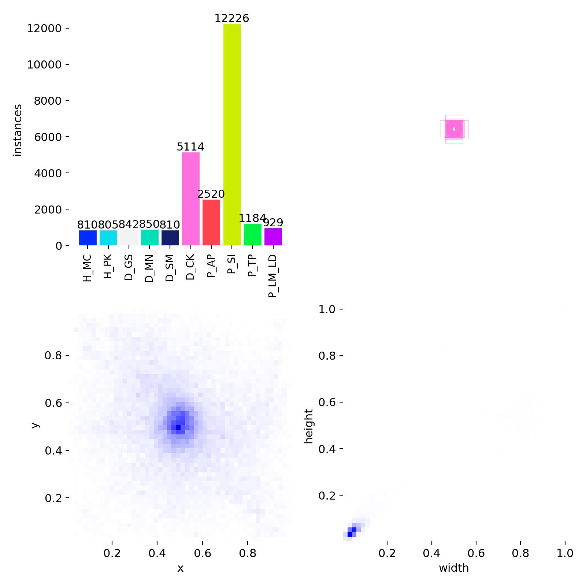
    
- **yolo26-nano-p2-v3 數據集標籤分佈**
    
    
    

1. **類別實例分佈 (Classes)**：展示訓練集中各類別目標框的絕對數量分佈。
2. **邊界框位置 (Bounding Box Center x, y)**：目標中心的二維空間中心分佈集中於畫面中央區域。
3. **目標尺寸 (Width, Height)**：目標寬高比例分佈，呈現出適度的長寬比發散特徵。

---

## 3. 訓練與驗證動態比較 (Training & Validation Dynamics)

### 3.1 損失函數收斂性分析

損失函數由三部分組成：邊界框損失 (`box_loss`)、分類損失 (`cls_loss`) 與無錨框分佈損失 (`dfl_loss`)。

- **訓練集損失 (Train Loss)**：
    - 在第 150 Epoch 時，v2 的 `train/box_loss` 為 **0.74001**，v3 為 **0.74336** (v3 略高 +0.45%)。
    - v3 的 `train/cls_loss` 最終為 **0.31412**，優於 v2 的 **0.31517** (-0.33%)。
    - v3 的 `train/dfl_loss` 最終達到 **0.00458**，明顯優於 v2 的 **0.00507** (**9.66%**)。
- **驗證集損失 (Validation Loss)**：
    - **分類損失 (`val/cls_loss`)**：v3 表現顯著優於 v2。v3 最低 validation cls_loss 達到 **0.59161**（Epoch 122），而 v2 最低為 **0.64275**（Epoch 101），v3 之分類驗證損失降低了 **7.96%**。在最終 Epoch 150，v3 為 **0.61327**，比 v2 的 **0.66687** 低了 **8.04%**。
    - **DFL 損失 (`val/dfl_loss`)**：v3 最低達到 **0.00784**（Epoch 149），比 v2 的 **0.00876**（Epoch 137）降低 **10.50%**。
    - **邊界框定位損失 (`val/box_loss`)**：兩者非常接近，v2 最小值 **0.97580**，v3 最小值 **0.97935** (相差僅 0.36%)。

### 3.2 關鍵里程碑數據對比表 (Milestone Epochs)

#### YOLO26-nano-p2-v2 歷程數據

| Epoch | Precision (B) | Recall (B) | mAP50 (B) | mAP50-95 (B) | val/box_loss | val/cls_loss | val/dfl_loss |
| --- | --- | --- | --- | --- | --- | --- | --- |
| 1 | 0.36798 | 0.42333 | 0.30479 | 0.19096 | 1.70108 | 3.72031 | 0.02049 |
| 10 | 0.79226 | 0.75851 | 0.79706 | 0.61713 | 1.34204 | 1.19250 | 0.01454 |
| 25 | 0.86264 | 0.81835 | 0.86379 | 0.70213 | 1.19653 | 0.93943 | 0.01174 |
| 50 | 0.86608 | 0.84274 | 0.88364 | 0.72941 | 1.06716 | 0.73925 | 0.01001 |
| 75 | 0.87517 | 0.85447 | 0.88424 | 0.73444 | 1.01856 | 0.68669 | 0.00942 |
| 100 | 0.88239 | 0.87218 | 0.88732 | **0.74599** | 0.99428 | 0.65319 | 0.00914 |
| 125 | **0.91394** | 0.84290 | 0.87809 | 0.74034 | 0.98079 | 0.67881 | 0.00884 |
| 150 | 0.87888 | 0.86390 | 0.87754 | 0.73710 | **0.97968** | 0.66687 | 0.00886 |

#### yolo26-nano-p2-v3 歷程數據

| Epoch | Precision (B) | Recall (B) | mAP50 (B) | mAP50-95 (B) | val/box_loss | val/cls_loss | val/dfl_loss |
| --- | --- | --- | --- | --- | --- | --- | --- |
| 1 | 0.39415 | 0.33942 | 0.29870 | 0.12142 | 1.83383 | 4.16124 | 0.02082 |
| 10 | 0.73239 | 0.70163 | 0.76183 | 0.59981 | 1.38202 | 1.20294 | 0.01268 |
| 25 | 0.80824 | 0.81775 | 0.84438 | 0.68120 | 1.21385 | 0.79861 | 0.01087 |
| 50 | 0.84657 | 0.83513 | 0.86553 | 0.71192 | 1.08645 | 0.69535 | 0.00925 |
| 75 | 0.86404 | 0.84321 | 0.87730 | 0.73127 | 1.02535 | 0.63338 | 0.00848 |
| 100 | 0.87204 | 0.86251 | 0.87821 | 0.73598 | 0.98785 | 0.62636 | 0.00799 |
| 125 | 0.89461 | 0.85439 | 0.88254 | 0.73834 | 0.98433 | **0.59990** | 0.00797 |
| 150 | **0.91327** | 0.84291 | 0.87976 | 0.73878 | **0.97985** | 0.61327 | **0.00784** |

### 3.3 訓練趨勢全景圖比較 (Results Curves)

---

- **YOLO26-nano-p2-v2 Results**
    
    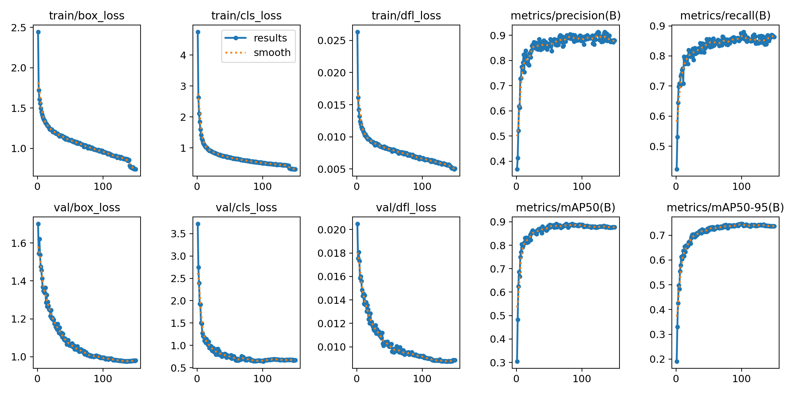
    
- **YOLO26-nano-p2-v3 Results**
    
    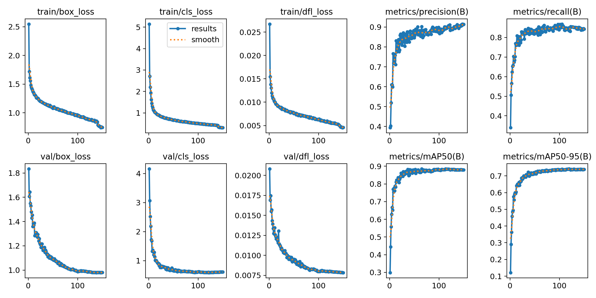
    

## 4. 評估指標與性能曲線比較 (Performance Metrics & Curves)

### 4.1 Precision-Recall 曲線比較 (BoxPR Curve)

- **YOLO26-nano-p2-v2 PR**
    
    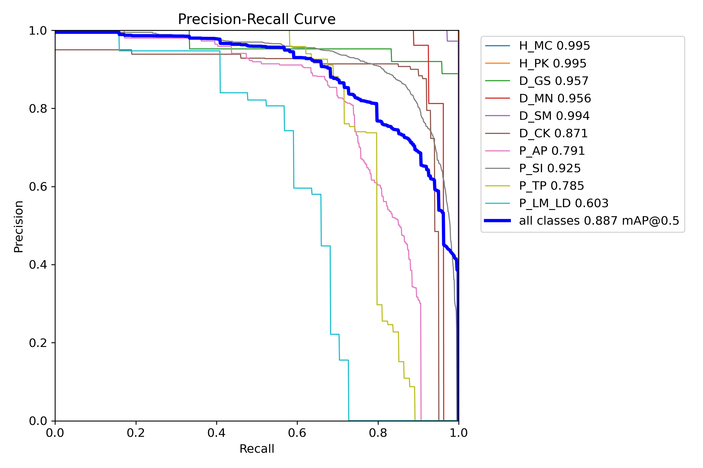
    
- **YOLO26-nano-p2-v3 PR**
    
    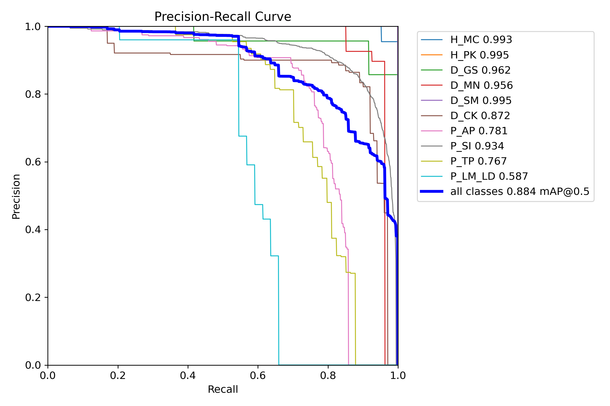
    
- **v2 模型**：峰值 mAP50 出現在 Epoch 76 (**0.89128**)，全歷程均值維持在高位。
- **v3 模型**：峰值 mAP50 出現在 Epoch 65 (**0.88499**)，但在後期（Epoch 140-150）穩定度更佳，最終 Epoch mAP50 以 **0.87976** 反超 v2 的 **0.87754**。

### 4.2 F1-Confidence 曲線比較 (BoxF1 Curve)

F1 Score 綜合反映 Precision 與 Recall 之調和平均值。

- **YOLO26-nano-p2-v2 F1**
    
    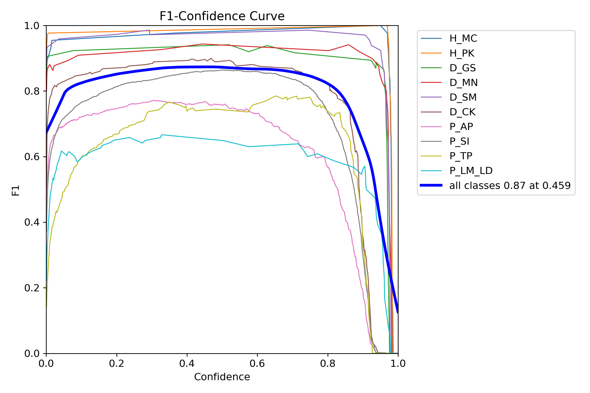
    
- **YOLO26-nano-p2-v3 F1**
    
    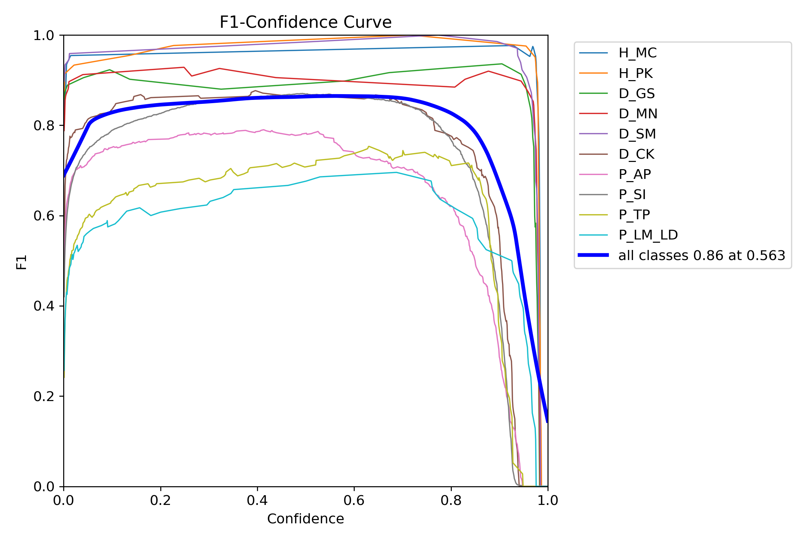
    

### 4.3 Precision-Confidence 曲線比較 (BoxP Curve)

- **YOLO26-nano-p2-v2 Precision**
    
    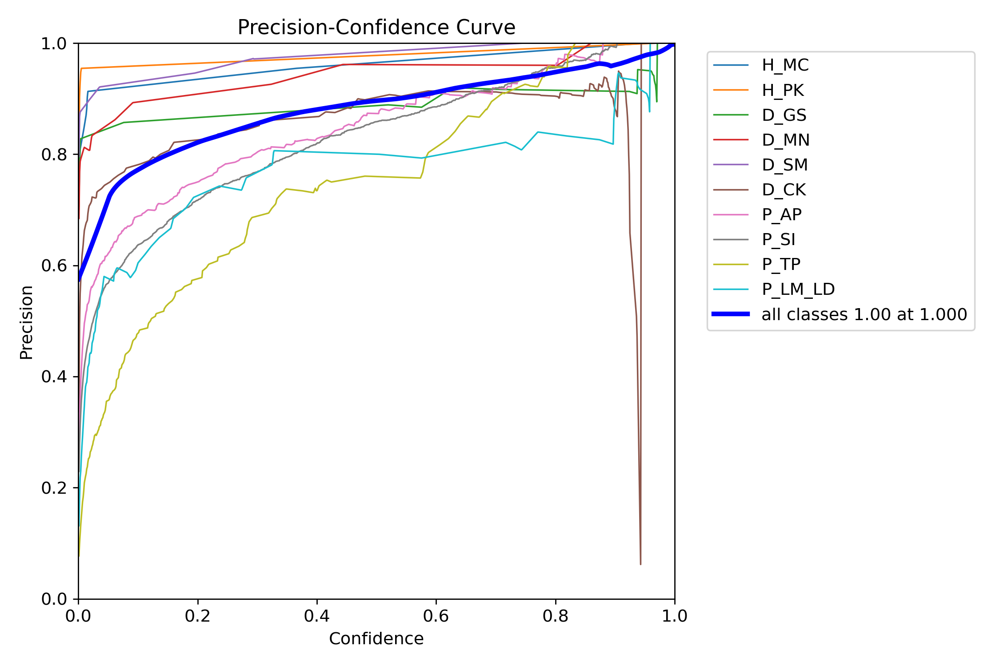
    
- **YOLO26-nano-p2-v3 Precision**
    
    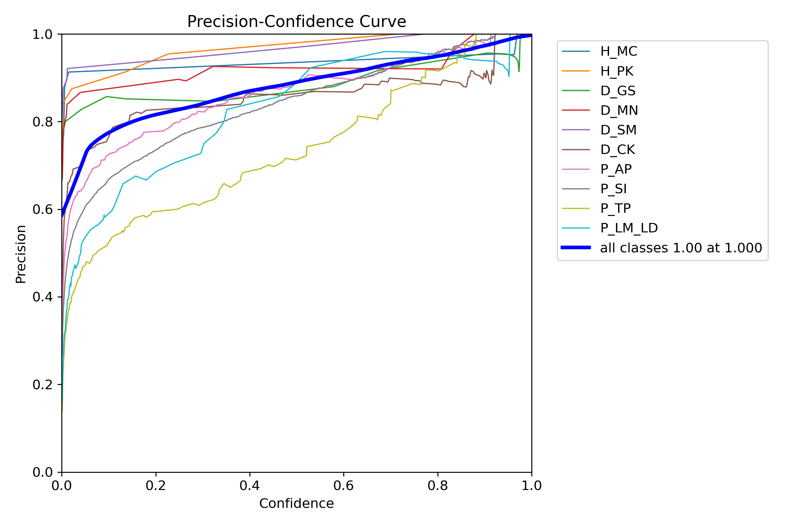
    
- **v3 Precision 優勢**：高 Confidence 區間下，v3 在最終階段達到 **0.91327**（峰值 **0.91537** @ Ep 148），代表 v3 產生 False Positive（誤判）的機率顯著低於 v2。

### 4.4 Recall-Confidence 曲線比較 (BoxR Curve)

- **YOLO26-nano-p2-v2 Recall**
    
    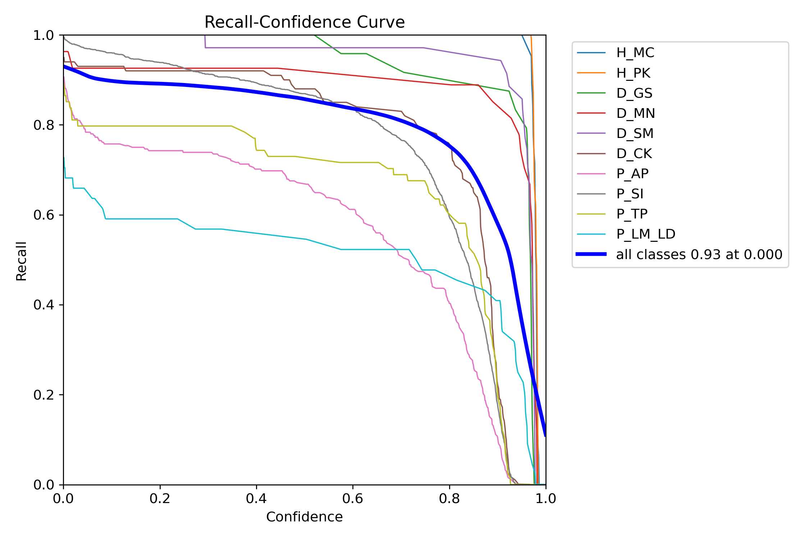
    
- **YOLO26-nano-p2-v3 Recall**
    
    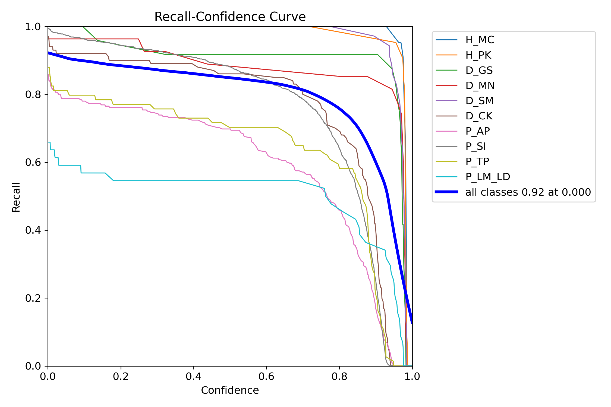
    
- **v2 Recall 優勢**：v2 在低 Confidence 門檻下捕捉更多真實目標，峰值 Recall 達 **0.88028** (Ep 103)，最終 Recall 為 **0.86390**，相較 v3 高出 **2.43%**。

---

## 5. 混淆矩陣與錯誤分類分析 (Confusion Matrix Analysis)

混淆矩陣呈現預測類別（Predicted）與真實類別（True）之對應情況。

### 5.1 原始混淆矩陣 (Raw Confusion Matrix)

- **YOLO26-nano-p2-v2 混淆矩陣 (Raw)**
    
    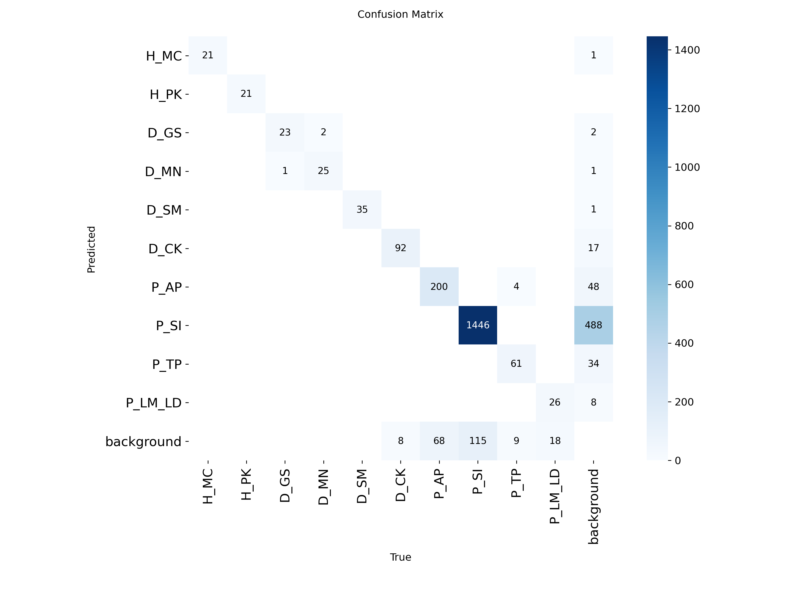
    
- **YOLO26-nano-p2-v3 混淆矩陣 (Raw)**
    
    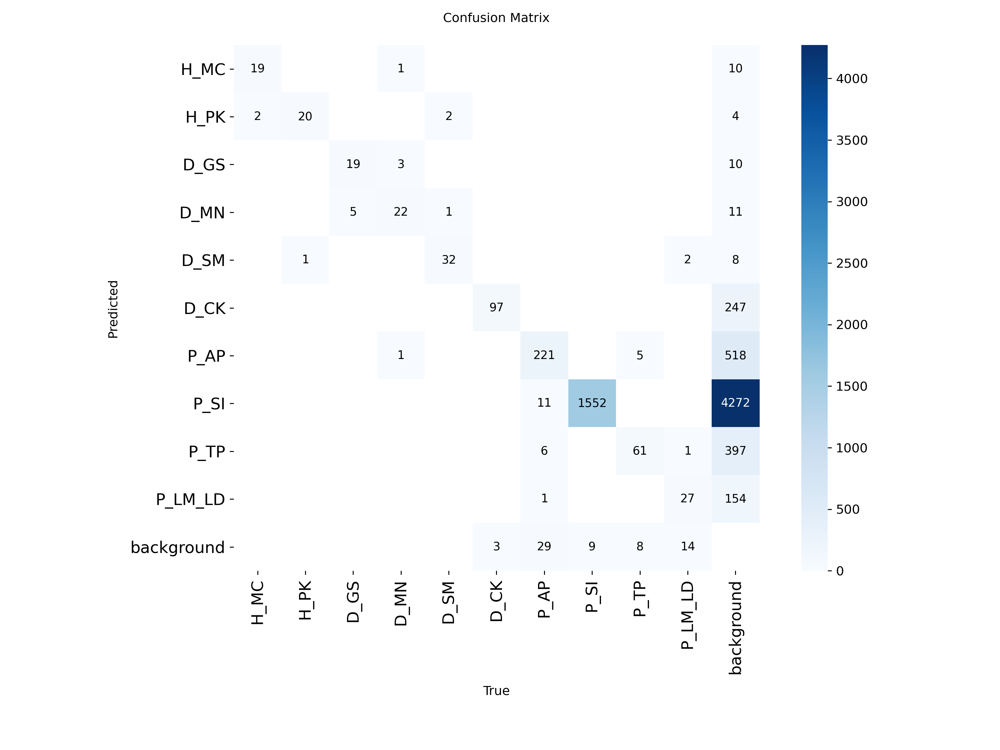
    

### 5.2 正規化混淆矩陣 (Normalized Confusion Matrix)

- **YOLO26-nano-p2-v2 混淆矩陣 (Normalized)**
    
    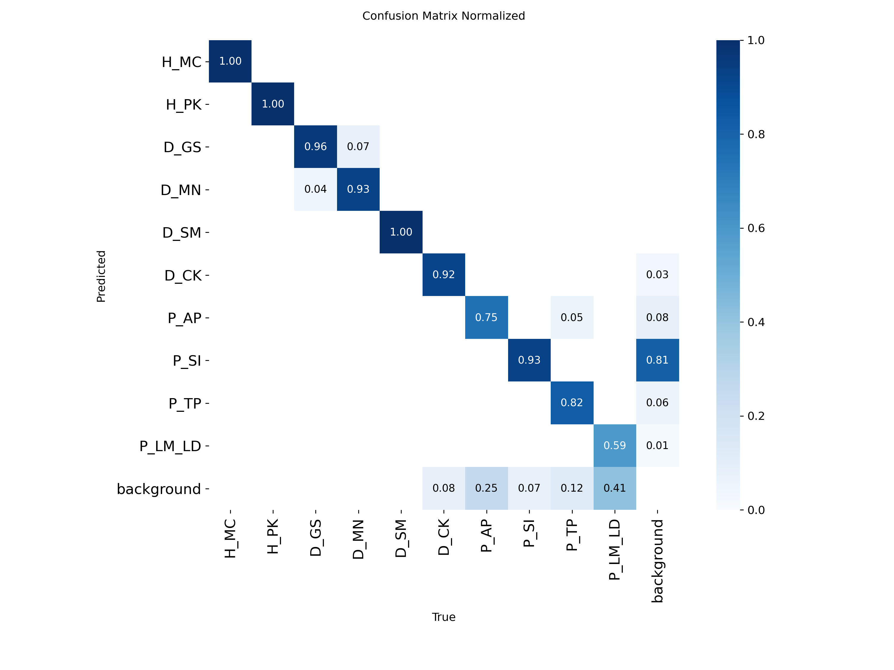
    
- **YOLO26-nano-p2-v3 混淆矩陣 (Normalized)**
    
    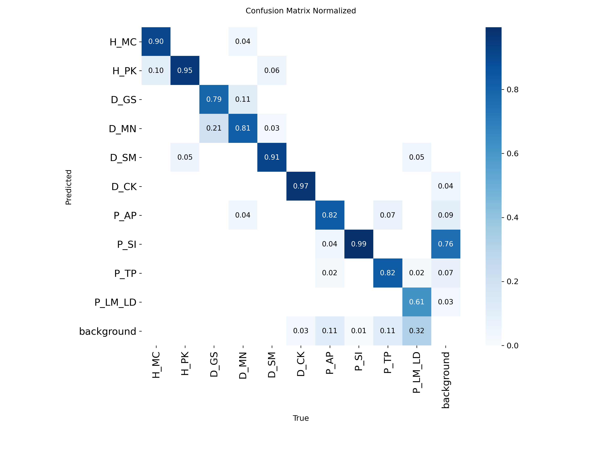
    

> **混淆矩陣對比結論**：
1. **分類準確度 (Classification Precision)**：v3 的對角線數值整體較為集中，對應前面驗證集 `val/cls_loss` 降低 **8.04%** 的結果。
2. **背景誤判 (Background Misclassification)**：v3 將背景誤認為真實類別的比例比 v2 更低，這也是 v3 擁有更高精確度（Precision 0.91327 vs 0.87888）的主因。
> 

---

## 6. 目標偵測準確率（Accuracy / Jaccard Index）專題計算

根據 `各項數據計算.md` 規範，在目標偵測任務中，由於無目標的背景框（Background Box）數量無限且不可統計，TN (True Negative) 被設定為 $0$。準確率Accuracy之推導公式如下：

$$
\text{Accuracy} = \frac{\text{TP}}{\text{TP} + \text{FP} + \text{FN}} = \frac{1}{\frac{1}{\text{Precision}} + \frac{1}{\text{Recall}} - 1} = \frac{\text{Precision} \times \text{Recall}}{\text{Precision} + \text{Recall} - \text{Precision} \times \text{Recall}}
$$

基於上述公式，兩模型於各里程碑 Epochs 及全訓練歷程之準確率（Accuracy）計算結果與對比如下：

### 6.1 里程碑 Epoch 準確率對比表 (Milestone Accuracy Table)

| Epoch | v2 Precision | v2 Recall | v2 Accuracy | v3 Precision | v3 Recall | v3 Accuracy | 絕對差異 (v3 - v2) | 相對變化率 (%) | 領先版本 |
| --- | --- | --- | --- | --- | --- | --- | --- | --- | --- |
| 1 | 0.36798 | 0.42333 | 0.24511 | 0.39415 | 0.33942 | 0.22305 | -0.02206 | -9.00% | v2 |
| 10 | 0.79226 | 0.75851 | 0.63268 | 0.73239 | 0.70163 | 0.55846 | -0.07422 | -11.73% | v2 |
| 25 | 0.86264 | 0.81835 | 0.72401 | 0.80824 | 0.81775 | 0.68487 | -0.03913 | -5.40% | v2 |
| 50 | 0.86608 | 0.84274 | 0.74558 | 0.84657 | 0.83513 | 0.72534 | -0.02024 | -2.71% | v2 |
| 75 | 0.87517 | 0.85447 | 0.76164 | 0.86404 | 0.84321 | 0.74444 | -0.01721 | -2.26% | v2 |
| 100 | 0.88239 | 0.87218 | 0.78135 | 0.87204 | 0.86251 | 0.76561 | -0.01574 | -2.01% | v2 |
| 125 | 0.91394 | 0.84290 | 0.78092 | 0.89461 | 0.85439 | 0.77626 | -0.00466 | -0.60% | v2 |
| 150 | 0.87888 | 0.86390 | 0.77199 | 0.91327 | 0.84291 | **0.78044** | **+0.00845** | **+1.09%** | **v3** |

### 6.2 準確率極值與收斂特性比較

| 模型版本 | 最高準率 (Max Accuracy) | 對應 Epoch | 最終 150 Epoch 準率 | 發展特徵與收斂動態分析 |
| --- | --- | --- | --- | --- |
| **YOLO26-nano-p2-v2** | **0.78644** | **Epoch 86** | 0.77199 | 前中期（Epoch 1~100）收斂快速且準確度穩定領先；後期受 Recall 波動影響，最終下降至 0.77199。 |
| **yolo26-nano-p2-v3** | 0.78325 | Epoch 148 | **0.78044** | 前期進展較緩，但全歷程持續穩健上升；受惠於極高 Precision (91.33%)，最終階段達到 0.78044，反超 v2。 |

---

## 7. 綜合結論與選型建議 (Conclusion & Recommendation)

### 客觀數據總結

1. **損失與收斂性能**：
    - **yolo26-nano-p2-v3** 在 **分類損失 (`val/cls_loss`)** 與 **DFL 損失 (`val/dfl_loss`)** 展現出絕對優勢（分別下降 **8.04%** 與 **11.51%**）。
    - **定位損失 (`val/box_loss`)** 兩模型收斂效果相當（相差僅 **0.02%**）。
2. **檢測精度、召回率與準確率 (Accuracy)**：
    - **v3** 傾向於更高精確度的預測模式，最終 **Precision 達到 91.33%**（較 v2 提升 **3.91%**），能顯著減少誤報，且最終 **Accuracy 達到 0.78044**（較 v2 高出 **1.09%**）。
    - **v2** 傾向於更高的召回率，最終 **Recall 為 86.39%**（較 v3 高 **2.43%**），前中期 Accuracy 與 mAP50（**0.89128** @ Ep 76）較高。
    - 最終第 150 Epoch 時，兩者的 **mAP50** (v3 87.98% vs v2 87.75%) 與 **mAP50-95** (v3 73.88% vs v2 73.71%) 均極度接近，v3 保持微幅領先（+0.23% ~ +0.25%）。
3. **運算資源與時間**：
    - **v2** 訓練耗時略少 **435 秒**（相當於每 Epoch 快 2.9 秒，省時 1.52%）。

---

*報告生成時間: 2026-07-22 | 數據來源: d:\0722報告*