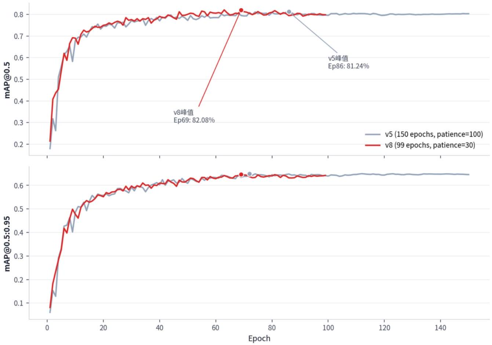
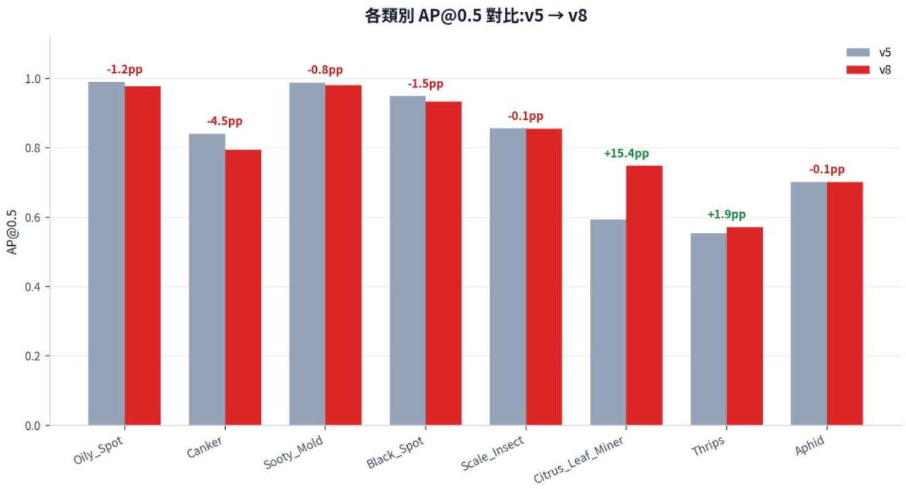

# v8_v5_數據比較報告

## v8 與 v5 訓練成效數據比較報告  YOLO26n＿P2＿Citrus＿MuSGD＿v5－2 vs YOLO26n＿P2＿Citrus＿MuSGD＿v8

## 一、比較前提與結論摘要

資料集與架構同一性已核對：兩者皆使用同一份 Citrus＿YOLO26＿Detect 資料集（Train 21，014 bbox、Valid 2，250 bbox，逐類別數量一致）與官方預設 YOLO26n－P2 架構（無自訂模組）。指標差異可歸因於超參數與訓練排程設定。

- 全類別 mAP＠0．5（各自最佳 epoch）：v5 81．24％→ v8 82．08％，＋0．84pp
- 各類別表現非全面提升：8 類中5類退步、3類進步；Citrus＿Leaf＿Miner 由59．4％升至74．8％（＋15．4pp），為最大單一變動
－訓練效率：v8 達到自身峰值所需時間為3．01小時，v5 為3．86小時；總訓練時間 v8少2．41小時
－mAP＠0．5：0．95 兩者接近，v5 全程峰值（64．99％，Ep72）略高於 v8 全程峰值（64．69％，Ep69）

## 二、超參數設定差異

下表僅列兩份報告皆有數值記載的參數；「未列出」代表另一報告未提供對應數值，不代入推測。

| 参數 | v5 | v8 | 差異 |
| --- | --- | --- | --- |
| patience | 100 | 30 | 收緊 70 epoch |
| 1r0 | 0.01 | 0.008 | 降低 20％ |
| 學習率排程 | 線性衰減 | 餘弦退火 | 排程方式不同 |
| close＿mosaic | 10 | 30 | 延長 20 epoch |
| cls 損失係數 | 0.5 | 0.8 | ＋60％ |
| box 損失係數 | 7.5 | 8.0 | ＋6．7％ |
| batch／imgsz／optimizer／ momentum／dfl | 32 ／ 640 ／MuSGD／ 0.937 ／ 1.5 | 相同 | 無差異 |
| weight＿decay／seed／ auto＿augment | 0.0005 ／ 42 ／randaugment | 未列出 | 無法核實 |

## 三、整體驗證指標比較

最佳 Epoch（mAP＠0．5 最大值所在列）

| 指標 | v5（Ep86） | v8（Ep69） | 差值（v8－v5） |
| --- | --- | --- | --- |
| mAP＠0．5 | 81．24％ | 82．08％ | ＋0．84pp |
| mAP＠0．5：0．95 | 64．83％ | 64．69％ | －0．14pp |
| Precision | 82．65％ | 80．17％ | －2．48pp |
| Recall | 76．57％ | 79．97％ | ＋3．40pp |
| ｜P－R｜ | 6．08pp | 0．20pp | －5．88pp |

最終 Epoch（v5：150／v8：99）
v8於峰值後30 epoch（等於patience設定）停止；v5於峰值後持續運行至 150 epoch 上限（峰值後 64 epoch）。兩者最終 epoch與各自峰值的距離不同，故下表僅供參考，不作為主要比較基準。

| 指標 | v5（Ep150） | v8（Ep99） | 差值（v8－v5） |
| --- | --- | --- | --- |
| mAP＠0．5 | 80．32％ | 79．83％ | －0．49pp |
| mAP＠0．5：0．95 | 64．58％ | 64．23％ | －0．36pp |
| Precision | 82．84％ | 84．10％ | ＋1．27pp |
| Recall | 77．67％ | 76．64％ | －1．03pp |

四、收斂速度與訓練效率

| 門檻／項目 | v5 | v8 |
| --- | --- | --- |
| $\mathrm{mAP} @ 0.5 \pm 0.80$ 首次達標 | Epoch 62 | Epoch 47 |
| 各自峰值 Epoch | 86 | 69 |
| 抵達峰值所需時間 | 3.86 小時 | 3.01 小時 |
| 總訓練時間 | 6.73 小時（150 epoch 跑滿） | 4.32 小時（99 epoch 早停） |

v5 vs v8 驗證指標收斂曲線疊圖

圖 1：v5 vs v8 驗證指標收斂曲線疊圖（資料來源：results．csv）

五、各類別 AP＠0．5 比較

| 類別 | v5 | v8 | 差值 |
| --- | --- | --- | --- |
| Oily＿Spot | 0.990 | 0.978 | －1．2pp |
| Canker | 0.840 | 0.795 | －4．5pp |
| Sooty＿Mold | 0.988 | 0.980 | －0．8pp |
| Black＿Spot | 0.949 | 0.934 | －1．5pp |
| Scale＿Insect | 0.856 | 0.855 | －0．1pp |
| Citrus＿Leaf＿Miner | 0.594 | 0.748 | ＋15．4pp |
| Thrips | 0.553 | 0.572 | ＋1．9pp |
| Aphid | 0.702 | 0.701 | －0．1pp |
| 全類別 mAP＠0．5 | 0.809 | 0.820 | ＋1．1pp |

圖 2：各類別 AP＠0．5 對比（資料來源：v5 報告表 6.1 、v8 報告表 4．3）

## 六、補充發現

－Loss 係數還原後，v5 、v8 驗證損失量級差距由原始7．9％（box）、62．3％（cls）分別收斂至1．2％、1．4％— —顯示原始 Loss 曲線的落差主要來自 box／cls 損失係數不同，而非模型擬合品質差異
- 最後 10 epoch mAP＠0．5 波動範圍：v5 ±0．0014，v8 ±0．0059（約為 v5 的 4.2 倍）
- Val／Train Loss 比（各自最佳 epoch）：v8 的 box（1．090×）、 cls（1．288×）均低於 v5 的 box（1．153×）、 cls（1．346×）

## 七、修正方向效益評估

| 方向 | 預期效益 | 主要依據 | 前提／風險 |
| --- | --- | --- | --- |
| 重建資料集（標註格式統一／針對性增補） | 高 | Thrips、Citrus＿Leaf＿Miner 為兩報告一致認定的最弱兩類，且標註量最低 | 應優先做低成本的標註格式統一，而非全面新增拍攝樣本 |

| 方向 | 預期效益 | 主要依據 | 前提／風險 |
| --- | --- | --- | --- |
| 繼續 V9 開發 | 未知（潛在最高） | 架構改動方向與 Thrips 弱點成因描述一致，但尚無實測數據 | 須先修復已知的2個程式錯誤（ADown 形狀不符、 IoU 交集算式錯誤） |
| 延續 v8 排程，擴大超參數搜索 | 低 | v5→v8 已用最大槓桿（cls＋60％），換來的是跨類別重新分配而非全面提升 | 邊際效益遞減，不建議作為主力方向 |

待釐清事項：v8 於峰值後僅 30 epoch 即停止（等於 patience 設定值），現有數據無法回答若採用與 v5相同或更高的 patience，v8 後續是否能達到更高的 mAP＠0．5。建議作為後續超參數實驗的對照變因。

## 八、指標彙總表

| 指標 | v5 | v8 | 差值（v8－v5） |
| --- | --- | --- | --- |
| mAP＠0．5（最佳 epoch） | 0.8124 | 0.8208 | ＋0．84pp |
| mAP＠0．5：0．95（最佳 epoch，同一 epoch） | 0.6483 | 0.6469 | －0．14pp |
| mAP＠0．5：0．95（各自全程峰值） | 0.6499 | 0.6469 | －0．31pp |
| ｜P－R｜（最佳 epoch） | 6．08pp | 0．20pp | －5．88pp |
| 達 mAP＠0．5 $\geq 0.80$ 所需 epoch | 62 | 47 | －15 |
| 總訓練時間 | 6.73 小時 | 4．32小時 | －2．41 小時 |
| 最後 10 epoch mAP＠0．5 波動（±） | 0.0014 | 0.0059 | ＋0．0045 |
| AP＠0．5 全類別平均 | 0.809 | 0.820 | ＋1．1pp |
| AP＠0．5：v8 較高的類別數 | － | － | 3 ／ 8 |
| AP＠0．5 最大單類別升幅 | Citrus＿Leaf＿Miner | － | ＋15．4pp |
| AP＠0．5 最大單類別降幅 | Canker | － | －4．5pp |