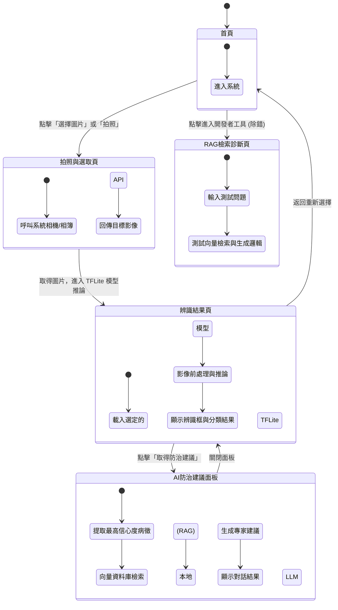

# UML

## 系統流程與 UML 狀態圖

---

## 頁面操作說明

1. **首頁**：使用者開啟應用程式後會看到此頁面，在此選擇要進行的任務（例如：開啟相機、選擇相簿照片或進入開發者除錯頁面）。
2. **拍照與影像選取頁**：透過系統原生 API（如 Google 內建照片選擇器），幫助使用者安全地選取葉片照片或立即拍攝照片，取得影像後自動導向辨識流程。
3. **辨識結果頁**：在此頁面，使用者可從上方選單切換想要使用的 TFLite 模型。選擇圖片後，系統會在本地端快速進行推論，並在畫面上顯示包含 Bounding Box 的影像，同時列出前幾名的推論類別與信心度。
4. **AI 防治建議面板**：在辨識出病蟲害後，使用者可點擊對應按鈕展開此面板。系統會將辨識結果自動化作問題，發送至本地端的檢索增強生成 (RAG) 系統，並即時回饋 AI 針對該病害生成的治療與防治措施。
5. **RAG 檢索診斷頁**：提供給開發者與測試人員的獨立頁面。不需經過圖像辨識流程，可直接輸入關鍵字或問句，檢視系統從 SQLite-VEC 知識庫中取出的 chunks 是否正確，並驗證 LLM (Qwen) 結合這些 chunks 後的問答表現。