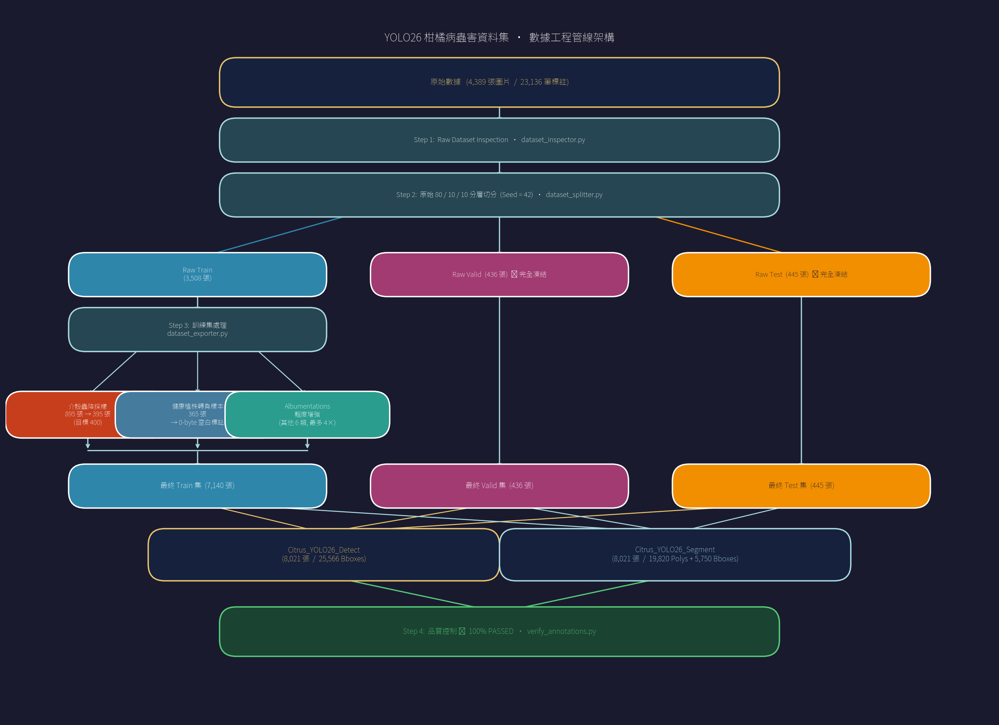
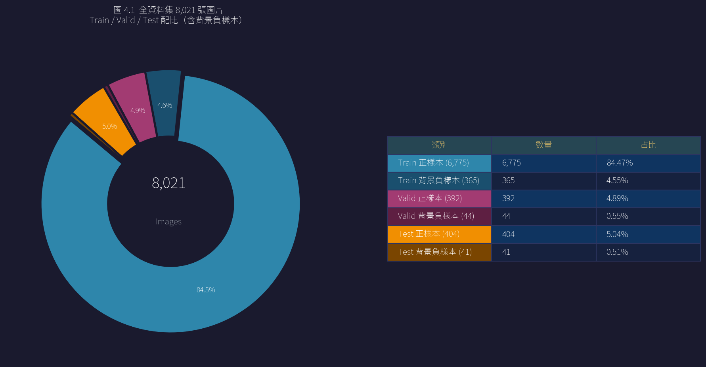

# Datasets_YOLO26_v5 資料集統計與工程規範報告

> **報告日期**：2026-07-28（原載於 YOLO26n-P2 訓練報告 §3，2026-08-27 依 README §6.2 移至本章）
> **評測對象**：`Datasets_YOLO26_v5`
> **資料來源**：`病蟲害辨識模型/20260729_yolo26n_p2_training_report.md` 原 §3「資料集概況」，內容原封不動僅搬移整理
> **撰寫人**：原始記錄未標註

## 1. 摘要

- `Datasets_YOLO26_v5` 共 8,021 張圖片、25,566 個標註框，涵蓋 8 個病蟲害類別，另含 450 張背景負樣本（5.61%）
- 採「先切分後增強」原則：先完成分層切分並凍結 Valid（436 張）與 Test（445 張），僅對 Train 集執行增強，避免數據洩漏
- 介殼蟲原始標註佔全體 66.47%，Train 集執行降採樣（895→395 張，−55.9%）以緩解類別失衡
- 同步導出 Detect 與 Segment 雙格式資料集，並通過自動化標註品質驗證（0 個越界座標、0 行語法錯誤）

| 項目 | 數值 |
| --- | --- |
| 總圖片數 | 8,021 |
| 總標註框數 | 25,566 |
| 類別數 | 8（病蟲害）+ 背景負樣本 |
| Train / Valid / Test 圖片數 | 7,140 / 436 / 445 |

> 本資料集與〈[Datasets_YOLO26_v2](yolo26_v2_dataset_stats.md)〉是不同版本、不同資料工程管線的產物（v5 將健康植株轉為背景負樣本、類別數由 10 縮減為 8、並執行介殼蟲降採樣），兩份報告分開記錄，不互相取代。兩者的類別編號（Class ID）也不對應——同一個編號在 v2、v5 兩份報告代表不同類別，引用時務必註明版本。
>
> 補充觀察：比對兩份報告的原始（工程介入前）標註數，v2、v5 有 7/9 個非健康類別逐位元完全相同（如介殼蟲皆為 15,379 個標註），僅蚜蟲、薊馬兩類數量不同（v5 分別多 358、1,015 個），推測兩者共用同一批原始標註資料、v5 額外補標了這兩類。此推測目前未見於任何既有文件證實，僅供後續查證參考。

## 2. 資料集規模與類別分佈

### 圖 2.1：數據工程管線架構

### 表 2.1：資料集規模摘要

| 資料集分割 | 圖片數 | Bboxes 數 | 背景負樣本 |
| --- | --- | --- | --- |
| **Train（含增強）** | 7,140 | 21,014 | 365 張（5.12%） |
| **Valid（凍結）** | 436 | 2,250 | 44 張（10.09%） |
| **Test（凍結）** | 445 | 2,302 | 41 張（9.21%） |
| **總計** | **8,021** | **25,566** | **450 張（5.61%）** |

### 表 2.2：原始資料集類別分佈（工程介入前）

| 類別 ID | 類別名稱 | 原始圖片數 | 原始標註數 | 平均標註密度 | 標註占比 |
| --- | --- | --- | --- | --- | --- |
| BG | 健康植株（轉負樣本） | 400 | 401 | 1.00 | 1.73% |
| `0` | 油斑病 | 238 | 237 | 1.00 | 1.02% |
| `1` | 潰瘍病 | 244 | 1,645 | 6.74 | 7.11% |
| `2` | 煤煙病 | 326 | 324 | 0.99 | 1.40% |
| `3` | 黑點病 | 250 | 251 | 1.00 | 1.08% |
| **`4`** | **介殼蟲** | **1,119** | **15,379** | **13.74** | **66.47%** |
| `5` | 潛葉蛾 | 201 | 281 | 1.40 | 1.21% |
| `6` | 薊馬 | 770 | 1,851 | 2.40 | 8.00% |
| `7` | 蚜蟲 | 841 | 2,767 | 3.29 | 11.96% |
| **合計** | — | **4,389** | **23,136** | **5.27** | **100.0%** |

> **介殼蟲降採樣**：介殼蟲原始標註占全體 **66.47%**，且平均密度為 13.74 個/張。本建置採「**介殼蟲降採樣：895 → 395 張（−55.9%）**」以緩解類別失衡。

### 圖 2.2：各類別圖片數 Train / Valid / Test 分佈

### 圖 2.3：全體 25,566 Bboxes 類別占比分佈

### 圖 2.4：Train 集 21,014 Bboxes 類別占比分佈（降採樣後）

### 圖 2.5：Train 集 Bbox 實際計數條形圖

> **labels 數據核驗**：條形圖顯示 Train 集各類別實際 Bbox 計數（Oily_Spot: 756、Canker: 5,267、Sooty_Mold: 1,036、Black_Spot: 800、Scale_Insect: 5,388、Citrus_Leaf_Miner: 904、Thrips: 2,841、Aphid: 4,022），與 YOLO26n-P2 訓練報告表 5.1 一致。寬高散布圖顯示多數 Bbox 尺寸偏小（width/height 集中於 0~0.1 歸一化範圍），為使用 P2 特徵頭（160×160 感受野）的依據之一。

## 3. v5 版本資料集製作策略與數據工程

為構建適合 YOLO26 / YOLOv11 全系列架構訓練的數據集，本次 `Datasets_YOLO26_v5` 資料集建置採用以下數據工程規範。

### 3.1 四大核心製作原則

1. **先切分後增強（Split Before Augment）**
   - **數據洩漏防範**：所有數據增強操作均在完成資料集分層切分（Stratified Split）並**凍結 Valid（436 張）與 Test（445 張）** 之後，僅對 Train 集執行。
   - Valid 與 Test 集保持原始狀態，未進行增強，確保驗證與測試結果客觀。
2. **健康植株轉 0-byte 背景負樣本**
   - 400 張健康柑橘植株圖片（椪柑 200 張 + 茂谷柑 200 張）全數清除標註，轉換為 **0-byte 空白標註檔** 之背景負樣本。
   - 最終全資料集含 **450 張背景負樣本 (5.61%)**（Train 365 張, Valid 44 張, Test 41 張），用於控制模型在非目標場景下的假陽性率（FP）。
3. **介殼蟲 (Scale Insect) 降採樣策略**
   - **標註分佈失衡**：原始 4,389 張圖片中，介殼蟲單一類別佔全體標註框的 **66.47% (15,379 / 23,136)**，平均標註密度為 **13.74 個/張**。
   - **降採樣實施**：僅在 Train 集將介殼蟲圖片數由原始 **895 張降採樣至 395 張 (−55.9%)**，Bbox 數量由 12,340 筆降至 5,388 筆 (−56.3%)。
   - **凍結集保留**：Valid (1,453 Bboxes) 與 Test (1,586 Bboxes) 保持不變。
4. **雙格式同步導出 (Detect & Segment)**
   - 同步導出 **Detect (5-Part Bbox)** 與 **Segment (Polygon)** 兩套資料集，共享相同的圖片與 Train/Valid/Test 切分。

### 3.2 數據增強參數與條件設定

對除介殼蟲與背景負樣本外其餘 7 個目標類別使用 Albumentations 進行離線增強（每類擴充至上限 1,200 張）：

| 增強操作 | 參數設定 | 觸發機率 | 設計考量 |
| --- | --- | --- | --- |
| **HueSaturationValue** | **hue_shift=±3°**, sat_shift=±15, val_shift=±15 | **p=0.50** | **限制色相偏移 (±3° ≈ 5%)**，防止綠色健康葉片因色相變化被誤判為黃化病斑 |
| **RandomBrightnessContrast** | brightness=±0.15, contrast=±0.15 | p=0.50 | 模擬光照強度與陰影環境 |
| **CLAHE** | clip_limit=2.0, tile_grid=(8,8) | p=0.30 | 調整暗部細節 |
| **GaussianBlur** | blur_limit=(3,5)px | p=0.20 | 模擬焦距微偏與動態模糊 |
| **ShiftScaleRotate** | shift=±5%, scale=±10%, rotate=±15° | p=0.50 | 模擬拍攝角度與距離變化 |

> **Bbox 可見度過濾**：設定 `min_visibility=0.2`，當旋轉或裁剪導致目標框可見面積低於 20% 時自動移除該框。

### 3.3 標註格式結構與 Segment 混合標註

原始數據包含 85.2% (19,718 筆) 多邊形與 14.8% (3,418 筆) 矩形框。Segment 資料集保留了標註格式的原始屬性：

- **單一 Polygon 類別**：油斑病、煤煙病、黑點病、潰瘍病、潛葉蛾（均 > 98% 多邊形）。
- **混合格式類別**：
  - **薊馬 (Thrips)**：Train 集中含 **1,516 個 Poly + 1,325 個 Bbox**。
  - **蚜蟲 (Aphid)**：Train 集中含 **330 個 Poly + 3,695 個 Bbox**。
  - 轉換為 Detect 格式時，多邊形均轉為最小外接矩形框 (Minimum Bounding Box)。

### 3.4 自動化品質驗證 (Quality Control)

資料集通過 `src/verify_annotations.py` 測試驗證：

- `nc: 8` 類別數一致。
- 8,021 張圖像與標註檔完成 **1:1 配對**。
- **0 個越界座標 (Out-of-Bounds)**、**0 行語法錯誤 (Malformed)**。
- 450 個背景負樣本 **核驗為 0-byte 空白檔**。

## 4. 結論與限制

`Datasets_YOLO26_v5` 相較 v2 版本重新定義了類別體系（健康植株轉為背景負樣本、類別數由 10 縮減為 8）並執行介殼蟲降採樣，是 YOLO26n-P2（見〈[20260729_yolo26n_p2_training_report](../%E7%97%85%E8%9F%B2%E5%AE%B3%E8%BE%A8%E8%AD%98%E6%A8%A1%E5%9E%8B/20260729_yolo26n_p2_training_report.md)〉）訓練所實際使用的資料集版本。

本報告未涵蓋：v5 相對 v2 的完整版本差異對照、資料集建置的原始腳本與流程紀錄。
